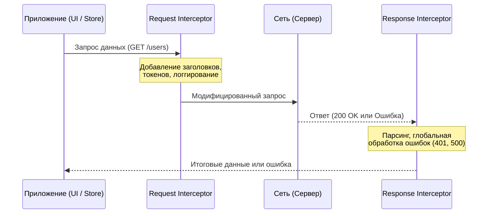

# Interceptors (Перехватчики)

Представьте, что ваше приложение делает десятки, а то и сотни сетевых запросов. Почти каждый из них требует добавления `Authorization` заголовка. Многие ответы могут вернуться со статусом `401 Unauthorized`, требуя обновления токена (refresh token). Если добавить логирование ошибок, обработку глобальных таймаутов и индикаторы загрузки, ручная обработка каждого запроса превратится в хаос дублирующегося кода и нарушит принцип DRY.

Здесь на сцену выходят **Interceptors (Перехватчики)** — паттерн промежуточного слоя (middleware) для HTTP-клиента. Они позволяют перехватывать запросы до их отправки в сеть и ответы до того, как они достигнут бизнес-логики (например, ваших компонентов или сторов).

## Как это работает

Интерцепторы образуют цепочку (pipeline), через которую проходит каждый запрос и ответ.



## Где это применимо

- **Аутентификация:** Подстановка Bearer-токенов во все запросы.
- **Обработка сессий:** Автоматический refresh токена при получении 401.
- **Глобальная обработка ошибок:** Показ системных уведомлений при 500 ошибках сервера.
- **Трансформация данных:** Конвертация camelCase в snake_case и наоборот.
- **Логирование и аналитика:** Сбор метрик времени ответа.

## Примеры реализации

### Хорошая практика: Изолированная обработка Refresh Token (на примере Axios)

Хороший интерцептор решает проблему гонки (race conditions) при обновлении токена. Если 5 запросов одновременно вернули 401, токен должен обновиться только один раз, а остальные запросы должны подождать.

```typescript
import axios from 'axios';

const api = axios.create({ baseURL: 'https://api.example.com' });

let isRefreshing = false;
let failedQueue: Array<{ resolve: (value?: unknown) => void, reject: (reason?: any) => void }> = [];

const processQueue = (error: any, token: string | null = null) => {
    failedQueue.forEach(prom => {
        if (error) prom.reject(error);
        else prom.resolve(token);
    });
    failedQueue = [];
};

// Request Interceptor
api.interceptors.request.use(config => {
    const token = localStorage.getItem('accessToken');
    if (token && config.headers) {
        config.headers.Authorization = `Bearer ${token}`;
    }
    return config;
});

// Response Interceptor
api.interceptors.response.use(
    response => response,
    async error => {
        const originalRequest = error.config;

        if (error.response?.status === 401 && !originalRequest._retry) {
            if (isRefreshing) {
                return new Promise((resolve, reject) => {
                    failedQueue.push({ resolve, reject });
                }).then(token => {
                    originalRequest.headers.Authorization = 'Bearer ' + token;
                    return api(originalRequest);
                }).catch(err => Promise.reject(err));
            }

            originalRequest._retry = true;
            isRefreshing = true;

            try {
                // Псевдокод получения нового токена
                const { data } = await axios.post('https://api.example.com/refresh');
                localStorage.setItem('accessToken', data.token);
                
                processQueue(null, data.token);
                return api(originalRequest);
            } catch (err) {
                processQueue(err, null);
                // Логика разлогина (очистка стора, редирект)
                return Promise.reject(err);
            } finally {
                isRefreshing = false;
            }
        }

        return Promise.reject(error);
    }
);
```

### Анти-паттерн: Привязка UI-логики и циклические зависимости

Худшее, что можно сделать с интерцепторами — это завязать их на конкретный UI-фреймворк или создать циклическую зависимость с глобальным стейтом.

```typescript
// АНТИ-ПАТТЕРН: Никогда так не делайте
import axios from 'axios';
import { useNavigation } from 'react-router-dom'; // Хуки вне React-компонента!
import { store } from './store'; // Если store импортирует API, мы получим цикл

api.interceptors.response.use(res => res, error => {
    if (error.response.status === 401) {
        // Вызовет ошибку, хуки нельзя использовать здесь
        const navigate = useNavigation(); 
        navigate('/login'); 
        
        // Жесткая привязка к стору усложняет тестирование
        store.dispatch({ type: 'LOGOUT' }); 
    }
    return Promise.reject(error);
});
```
*Как исправить:* Используйте паттерн Dependency Injection или EventEmitter. Сетевой слой должен бросать события (например, `onUnauthorized`), а инфраструктурный слой или Router должны на них реагировать.

## Неочевидные нюансы, компромиссы и границы применимости

### Скрытый оверхед
Интерцепторы выполняются для **каждого** запроса, настроенного на данный инстанс клиента. Добавление тяжелых синхронных операций (глубокое клонирование, сложный парсинг больших JSON) внутри request/response интерцепторов заблокирует выполнение запроса и замедлит приложение.

### Иллюзия глобального контроля (Где ломается паттерн)
Интерцепторы — это инструмент для **сквозного функционала (cross-cutting concerns)**. Они ломаются, когда в них начинают запихивать бизнес-специфичную логику.
* **Не используйте интерцепторы** для валидации ответа конкретного эндпоинта (например, проверки, что `user.age > 18`). Это ответственность слоя бизнес-логики (Use Cases) или мапперов (DTO -> Domain).
* Если логика касается только одного-двух запросов из ста, выносите ее в отдельную функцию-обертку, а не пишите монструозные `if (config.url === '/special')` в глобальном интерцепторе.

### Зависимости и архитектурные границы
Сетевой слой находится на самом краю инфраструктурного кольца (в терминологии Clean Architecture). Он не должен ничего знать о React, Redux, Vuex или конкретной реализации роутинга. Если интерцептор начинает управлять модалками или вызывать экшены глобального стора напрямую — граница нарушена. В таких случаях интерцептор должен делегировать управление через callback'и или бросать специфичные исключения, которые перехватят слои выше.
