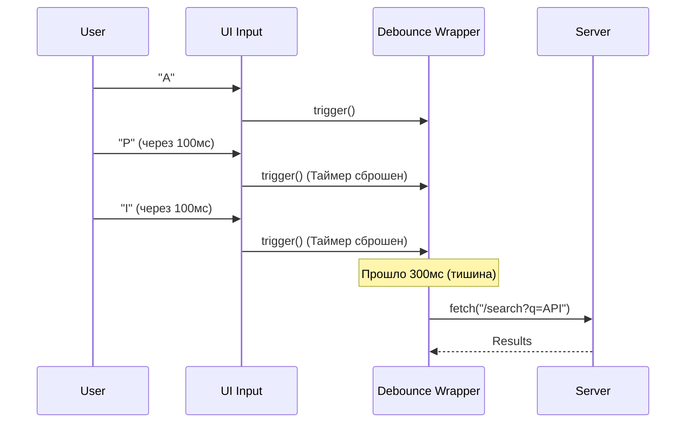

# Rate Limiting (Ограничение частоты запросов)

Rate Limiting во фронтенде — это набор стратегий, предотвращающих отправку слишком большого количества HTTP-запросов на сервер за короткий промежуток времени. 

Боль, которую мы решаем: DDoS атака собственным интерфейсом. Представьте поле поиска (Autocomplete), которое отправляет запрос на сервер при каждом нажатии клавиши. Если пользователь печатает слово "Architecture" со скоростью 10 символов в секунду, мы отправим 12 бесполезных запросов (на буквы A, Ar, Arc...). Сервер будет вычислять тяжелый поиск по БД, а когда ответит — результаты первых 11 запросов уже никому не нужны. Хуже того, сервер может заблокировать нашего пользователя с ошибкой `HTTP 429 Too Many Requests`.



### Как это работает на практике
Два самых главных паттерна на клиенте — это **Debounce** и **Throttle**.
1. **Debounce (отскок)**: Функция выполнится только тогда, когда с момента последнего вызова пройдет N миллисекунд. Идеально для инпутов (ждем, пока юзер перестанет печатать).
2. **Throttle (дросселирование)**: Функция гарантированно выполняется не чаще, чем 1 раз в N миллисекунд. Идеально для скролла или ресайза (чтобы обновлять UI плавно, но не 60 раз в секунду).

### Пример кода (Правильное решение с Debounce)

```typescript
import { useState, useEffect } from 'react';

// Кастомный хук для задержки значения
function useDebounce<T>(value: T, delay: number): T {
  const [debouncedValue, setDebouncedValue] = useState(value);

  useEffect(() => {
    const handler = setTimeout(() => setDebouncedValue(value), delay);
    return () => clearTimeout(handler); // Отменяем таймер, если value изменилось
  }, [value, delay]);

  return debouncedValue;
}

function SearchBar() {
  const [search, setSearch] = useState('');
  const debouncedSearch = useDebounce(search, 500); // Ждем 500мс

  useEffect(() => {
    if (debouncedSearch) {
      // Этот запрос улетит только 1 раз, когда юзер закончит печатать
      api.get(`/search?q=${debouncedSearch}`); 
    }
  }, [debouncedSearch]);

  return <input value={search} onChange={e => setSearch(e.target.value)} />;
}
```

### Неочевидные нюансы и трейдоффы
1. **Race Conditions (Гонка данных)**: Даже с Debounce, если вы ввели "React", запрос улетел (и будет идти 2 секунды). Затем вы стерли и ввели "Vue", запрос улетел (и завершился за 100мс). Результаты для "Vue" отрисовались. А потом пришел долгий ответ для "React" и перезаписал UI! Rate limiting не спасает от гонок, для этого нужна **отмена запросов (AbortController)**.
2. **Обработка HTTP 429**: Если сервер все-таки вернул 429, хороший API клиент должен посмотреть на заголовок `Retry-After: 30`, подождать 30 секунд и попробовать снова, скрыв эту ошибку от пользователя (паттерн Retry with Backoff).
3. **Локальный оптимизм**: При Throttling кнопок лайка или добавления в корзину, интерфейс может казаться "тупящим", так как он ждет таймера. Для таких действий используют Оптимистичный UI: обновляют кнопку мгновенно, а запросы батчат и шлют в фоне.
