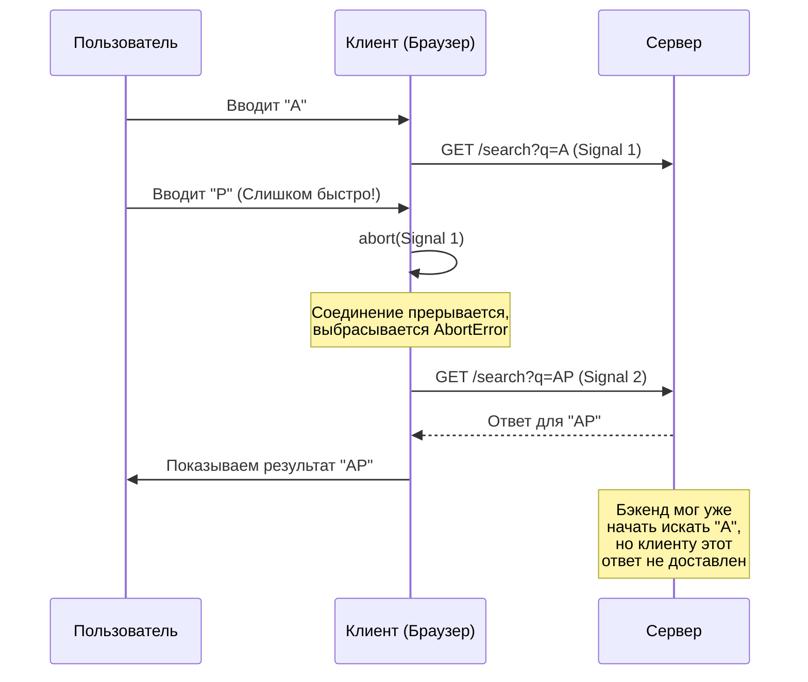

# Отмена сетевых запросов (Request Cancellation)

## Что это и какую боль решает

В современных интерактивных приложениях пользователи часто меняют контекст быстрее, чем сервер успевает обрабатывать запросы и отвечать на них. Примеры таких ситуаций:
- **Быстрый ввод (Typeahead / Autocomplete):** Пользователь печатает текст в поиске, и каждый новый символ порождает отдельный сетевой запрос.
- **Быстрая навигация:** Пользователь кликает на ссылку, начинается загрузка тяжелых данных для страницы, но он тут же передумывает и переходит на другую вкладку до завершения загрузки.
- **Повторные действия:** Многократное нажатие на кнопку фильтрации, если UI не был предварительно заблокирован.

Если не отменять "протухшие" (уже не актуальные для пользователя) запросы, возникает ряд серьезных проблем:

1. **Гонка данных (Race conditions):** Ответ от более старого (и более медленного) запроса может прийти *позже*, чем ответ от нового. В результате интерфейс отобразит неактуальные данные.
2. **Утечки памяти и лишние рендеры:** Компоненты пытаются обновить состояние (`setState`), хотя они уже были размонтированы (unmounted).
3. **Расход ресурсов:** Забивается лимит одновременных HTTP-соединений браузера к одному домену (обычно около 6), расходуется мобильный трафик пользователя.

**Отмена запросов** — это механизм принудительного прерывания HTTP-соединения со стороны клиента до того, как сервер пришлет ответ (или до того, как клиент его полностью скачает и обработает).

## Как это работает на практике

В экосистеме JavaScript стандартом де-факто для отмены запросов является встроенный API `AbortController`. Он работает в связке с нативным `fetch`, а также поддерживается современными HTTP-клиентами вроде Axios.

Объект `AbortController` предоставляет метод `abort()` и свойство `signal`. Сигнал прокидывается в параметры запроса. Как только вызывается `abort()`, запрос мгновенно прерывается, а промис отклоняется (rejects) со специфичной ошибкой `AbortError`.



## Примеры кода: Best Practices и Anti-patterns

### ❌ Anti-pattern: Игнорирование отмены
Без отмены запросов мы рискуем получить непредсказуемое состояние UI, если идентификатор быстро изменится несколько раз.

```javascript
// Внутри компонента React
useEffect(() => {
  // Если id изменится быстро (напр. с 1 на 2), мы можем получить 
  // ответ для id=1 ПОСЛЕ ответа для id=2. Состояние будет перезаписано старыми данными.
  fetchData(id).then(data => {
    setResult(data); 
  });
}, [id]);
```

### ✅ Best Practice: Использование AbortController
Привязка контроллера к жизненному циклу компонента или эффекта гарантирует, что мы работаем только с актуальным запросом.

```javascript
useEffect(() => {
  const controller = new AbortController();
  
  const loadData = async () => {
    try {
      const response = await fetch(`/api/data/${id}`, {
        signal: controller.signal // Привязываем сигнал
      });
      const data = await response.json();
      setResult(data);
    } catch (error) {
      // Важно отлавливать AbortError, чтобы не логировать это как реальный баг
      if (error.name === 'AbortError') {
        console.log('Запрос был отменен, игнорируем');
      } else {
        handleError(error);
      }
    }
  };

  loadData();

  // Cleanup функция сработает при размонтировании компонента 
  // или ПЕРЕД следующим вызовом этого же эффекта
  return () => {
    controller.abort();
  };
}, [id]);
```

### ✅ Best Practice: Современный инструментарий (TanStack Query)
Если вы используете продвинутые библиотеки управления серверным стейтом (React Query, RTK Query, SWR), ручное управление контроллерами почти не требуется. Библиотека сама создаст `signal` и вызовет `abort()`, если компонент размонтируется или ключ запроса изменится. Нужно лишь не забыть передать сигнал дальше.

```javascript
useQuery({
  queryKey: ['todos', todoId],
  queryFn: async ({ signal }) => {
    // Библиотека предоставляет signal. Просто прокиньте его в fetch/axios.
    const res = await fetch(`/api/todos/${todoId}`, { signal });
    if (!res.ok) throw new Error('Network response was not ok');
    return res.json();
  },
})
```

## Неочевидные нюансы и границы применимости

### 1. Отмена на клиенте ≠ Отмена на сервере
Когда клиент вызывает `abort()`, браузер закрывает сетевой сокет. **Но сервер об этом может не знать мгновенно или вообще не уметь это обрабатывать.** 
Если сервер выполняет тяжелый SQL-запрос или обращается к сторонним API, он может продолжить работу впустую, расходуя CPU, память и соединения с БД.
*Вывод:* Отмена запросов на клиенте спасает UI и сеть пользователя, но для защиты сервера от DDoS или перегрузки нужны серверные механизмы (мониторинг обрыва сокета, таймауты выполнения транзакций, rate limiting).

### 2. Границы применимости: Мутации (POST / PUT / DELETE)
**Критическое правило: избегайте отмены запросов, изменяющих состояние (mutations), если вы не уверены в их 100% идемпотентности.**
- **Когда НЕ нужно отменять:** Пользователь нажал "Оплатить покупку" и сразу закрыл окно. Если сделать `abort()`, TCP-пакет уже мог уйти на сервер. Сервер успешно проведет оплату, но клиент из-за отмены сокета получит ошибку и покажет пользователю "Оплата не удалась". Возникнет жесткая десинхронизация состояния.
- **Когда можно отменять:** Операции чтения (GET-запросы) или строго идемпотентные операции (например, автосохранение черновика `PUT /drafts/1`, где каждое новое сохранение просто перезаписывает предыдущее).

### 3. Накладные расходы (Overhead) и мониторинг
Создание логики отмены требует написания бойлерплейта (если не используются библиотеки вроде React Query). Кроме того, `AbortError` — это технически выброшенное исключение (exception). Если вы глобально перехватываете ошибки и отправляете их в системы мониторинга (например, Sentry или Datadog), необходимо явно отфильтровывать `AbortError` / `CanceledError`. Иначе ваши логи будут завалены "ошибками", которые на самом деле являются нормальным поведением пользователя.

Не стоит внедрять `AbortController` для каждого запроса в приложении. Для разовых запросов при инициализации статичных данных это может быть overengineering'ом. Применяйте отмену там, где риск race conditions и лишней нагрузки реален.
