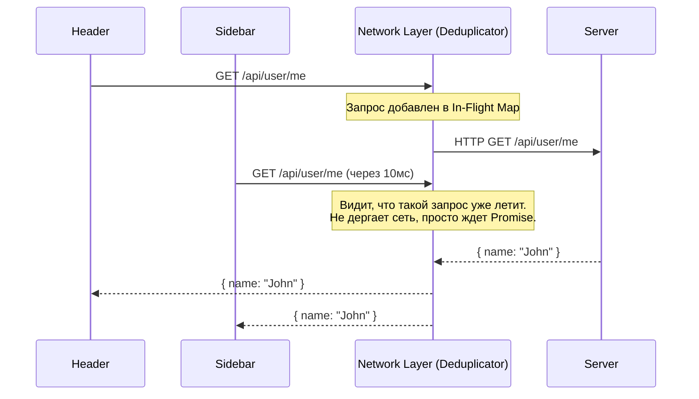

# Request Deduplication (Дедупликация запросов)

Дедупликация запросов — это архитектурный паттерн в сетевом слое фронтенда, при котором несколько идентичных (дублирующихся) запросов, запущенных почти одновременно, склеиваются в один реальный сетевой вызов.

Боль, которую мы решаем: избыточная нагрузка на сервер и сеть из-за независимых компонентов. Представьте, что у вас на странице есть компонент "Шапка" (показывает аватар), компонент "Сайдбар" (показывает имя) и компонент "Профиль". При монтировании страницы каждый из них независимо вызывает `fetch('/api/user/me')`. В результате в Network-панели летят 3 абсолютно одинаковых HTTP-запроса в одну и ту же миллисекунду.



### Как это работает на практике
Внутри вашего HTTP-клиента (или в библиотеке типа React Query) создается "словарь" летящих запросов (In-Flight Requests). Ключом служит URL (и параметры). Если кто-то просит сделать GET-запрос, клиент проверяет: если `Promise` по этому ключу уже существует и еще не разрешился (pending) — он просто возвращает этот же `Promise` второму компоненту. Оба компонента дождутся одного ответа.

### Пример кода (Антипаттерн vs Правильное решение)

**Антипаттерн**: Глупый Fetch в useEffect в разных компонентах.
```typescript
// Header.tsx
useEffect(() => { fetchUser().then(setUser) }, []);
// Sidebar.tsx
useEffect(() => { fetchUser().then(setUser) }, []); 
// Итог: 2 сетевых запроса
```

**Правильное решение**: Простой Дедупликатор.
```typescript
const inFlightRequests = new Map<string, Promise<any>>();

async function fetchWithDedupe(url: string) {
  if (inFlightRequests.has(url)) {
    return inFlightRequests.get(url); // Возвращаем существующий Promise!
  }

  const requestPromise = fetch(url)
    .then(r => r.json())
    .finally(() => {
      // Удаляем, когда запрос завершился (успешно или с ошибкой)
      inFlightRequests.delete(url); 
    });

  inFlightRequests.set(url, requestPromise);
  return requestPromise;
}

// Теперь можно вызывать fetchWithDedupe('/api/me') 100 раз подряд — улетит 1 запрос.
```

### Неочевидные нюансы и границы применимости
1. **Кеширование != Дедупликация**: Дедупликация работает ТОЛЬКО пока запрос находится в "полете" (In-Flight). Как только он завершился, следующий вызов `fetch` снова пойдет в сеть. Для долгосрочного хранения данных нужно комбинировать это с кешированием (SWR / React Query).
2. **Только безопасные методы**: Дедуплицировать можно только безопасные/идемпотентные методы (GET, OPTIONS). Если 5 раз подряд кликнуть на кнопку "Оплатить" (POST запрос), дедупликация склеит их в один POST, а сервер обработает один платеж — это может быть **ошибкой**, если юзер реально хотел оплатить 5 разных счетов. Для POST-запросов обычно дизаблят кнопку на UI (блокировка), а не используют дедупликацию в сетевом слое.
3. **Хеширование ключа**: Если это GraphQL или POST с телом (например, поиск), URL всегда одинаковый (`/graphql`). В таком случае ключом для Map должен служить хеш от URL + Body запроса.
