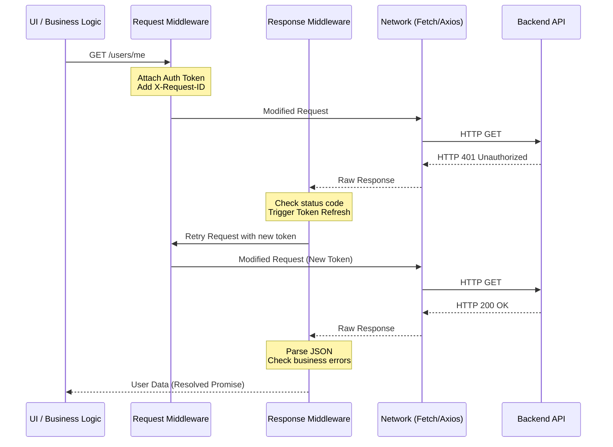

# Request Middleware (Interceptors)

## Что это такое?
Request Middleware (часто называемые интерцепторами или перехватчиками) — это паттерн проектирования сетевого слоя, позволяющий централизованно модифицировать исходящие HTTP-запросы и входящие ответы до того, как они достигнут конечной бизнес-логики.

## Какую боль решает?
В любом приложении, общающемся с сервером, возникают сквозные задачи (cross-cutting concerns):
- Добавление авторизационных токенов к каждому запросу.
- Логирование сетевой активности.
- Глобальная обработка ошибок (например, автоматический редирект на страницу логина при 401).
- Повторные попытки (retry) при нестабильной сети.
- Механизм обновления токенов (refresh-tokens).

Без Middleware этот код неизбежно размазывается по всем функциям API-клиентов, превращая их в нечитаемое месиво из `try/catch` и условных конструкций. Middleware решает эту проблему, вынося сквозную инфраструктурную логику в единый слой-прослойку.

## Как это работает на практике



### Примеры кода: Best Practices и Anti-patterns

**Anti-pattern: Размазывание инфраструктурной логики по методам**
В этом примере разработчик вручную обрабатывает авторизацию прямо в месте вызова, что приведет к дублированию кода в каждом сетевом запросе.
```typescript
async function fetchUserData() {
  const token = localStorage.getItem('token');
  const response = await fetch('/api/user', {
    headers: { 'Authorization': `Bearer ${token}` }
  });
  
  if (response.status === 401) {
    // Логика рефреша прямо в вызове бизнес-сценария
    await refreshToken();
    // Повторный вызов (дублирование логики)...
  }
  
  return response.json();
}
```

**Best Practice: Цепочка Middleware (на примере Axios)**
Здесь сетевой слой абстрагирует всю грязную работу, предоставляя бизнес-логике только чистые данные или понятные доменные ошибки.
```typescript
import axios from 'axios';

const api = axios.create({ baseURL: '/api' });

// Request Middleware (Pre-request)
api.interceptors.request.use(
  (config) => {
    const token = TokenStore.getAccessToken();
    if (token) {
      config.headers.Authorization = `Bearer ${token}`;
    }
    // Добавление уникального ID для распределенного трейсинга
    config.headers['X-Request-ID'] = crypto.randomUUID();
    return config;
  },
  (error) => Promise.reject(error)
);

// Response Middleware (Post-request)
api.interceptors.response.use(
  (response) => {
    // Успешный ответ прокидываем дальше
    return response;
  },
  async (error) => {
    const originalRequest = error.config;
    
    // Обработка 401 Unauthorized с помощью флага _retry для предотвращения бесконечного цикла
    if (error.response?.status === 401 && !originalRequest._retry) {
      originalRequest._retry = true;
      try {
        await AuthStore.refreshSession();
        // Повторяем оригинальный запрос с обновленным стейтом
        return api(originalRequest);
      } catch (e) {
        // Если рефреш не удался - выкидываем пользователя
        EventBus.emit('unauthorized');
      }
    }
    
    // Глобальная обработка инфраструктурных сбоев
    if (error.response?.status >= 500) {
      EventBus.emit('notify', 'Внутренняя ошибка сервера');
    }
    
    return Promise.reject(error);
  }
);
```

## Где применимо
- В **SPA (React, Vue, Angular)** для прозрачного управления сессиями, логирования и мониторинга (например, отправки контекста в Sentry).
- В **BFF (Backend-For-Frontend)** паттернах для добавления секретов к запросам перед походом в защищенные внутренние микросервисы.
- При интеграции с внешними API, где требуется rate-limiting, подпись запросов, или сквозное кэширование GET-запросов.

## Неочевидные нюансы и границы применимости

- **Проблема параллельного рефреша токена (Race Conditions):**
  Если при инициализации страницы (например, дашборда) отстреливают 10 параллельных запросов и все получают 401, наивный middleware запустит процедуру `refresh` 10 раз. Это приведет к лишней нагрузке на бэкенд и, вероятно, к инвалидации сессии.
  *Решение:* Использовать очередь (Promise Queue) или стейт-машину (`isRefreshing`), чтобы приостанавливать все последующие запросы, пока первый запрос не выполнит refresh, а затем разом зарезолвить всю очередь.

- **Связанность с UI (Over-coupling):**
  Часто в Response Middleware начинают запихивать логику навигации (например, `window.location = '/login'` или вызов `useRouter()`). Это грубое нарушение чистой архитектуры, так как инфраструктурный (сетевой) слой начинает зависеть от роутера, среды исполнения (DOM) и UI-фреймворка.
  *Решение:* Использовать шину событий (EventBus / EventEmitter) или Dependency Injection, чтобы сетевой слой просто бросал абстрактное доменное событие (например, `UnauthorizedEvent`), на которое уже подпишется корневой компонент приложения.

- **Скрытие бизнес-ошибок (Silencing Errors):**
  Если middleware слишком "умный" и самостоятельно обрабатывает бизнес-ошибки (например, 400 Bad Request с текстом ошибки валидации), продуктовый код может никогда не узнать, что что-то пошло не так, и UI зависнет в состоянии загрузки. Middleware должен перехватывать **только инфраструктурные ошибки** (401, 500, Timeout). Бизнес-ошибки нужно мапить в кастомные исключения (`DomainException`) и прокидывать дальше в слой бизнес-логики/UI.

- **Когда НЕ использовать:**
  Не используйте Request Middleware для мутации бизнес-пейлоада (тела запроса), если эта логика уникальна для одной конкретной фичи. Интерцепторы предназначены *только* для сквозных (cross-cutting) преобразований, применяемых ко всему приложению или к большому кластеру запросов. Если вам нужно трансформировать данные конкретного эндпоинта, делайте это внутри репозитория или сервиса, отвечающего за этот конкретный домен.
