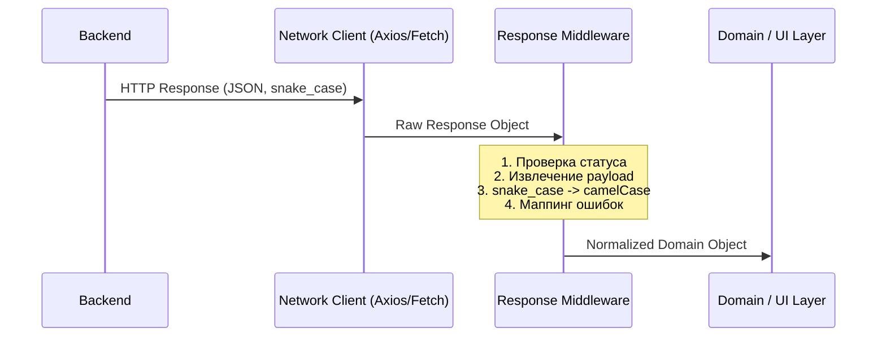

# Response Middleware

## Что это такое и какую боль решает

Представьте себе типичный Frontend-проект: бэкенд возвращает данные, завернутые в объект `{ "data": ... }`, ключи приходят в `snake_case`, даты в строковом формате ISO, а ошибки могут иметь три разных структуры в зависимости от микросервиса. 

Если каждый UI-компонент или стор будет самостоятельно "распаковывать" эти данные, преобразовывать стили написания ключей и парсить даты, кодовая база быстро превратится в нечитаемую кашу из утилитных функций. Хуже того, при малейшем изменении контракта бэкенда придется рефакторить десятки файлов.

**Response Middleware (или Interceptor)** — это паттерн сетевого слоя, который работает как единая таможня для всех входящих ответов от сервера. Он перехватывает "сырой" ответ до того, как тот попадет в бизнес-логику или UI, и нормализует его: распаковывает обертки, преобразует форматы, мапит ошибки и приводит данные к единому контракту, который ожидает фронтенд.

## Как это работает на практике

Архитектурно Response Middleware встраивается между HTTP-клиентом (например, `fetch` или `axios`) и слоем домена/инфраструктуры.



### Антипаттерн: Протекание серверных контрактов в UI

Когда middleware нет, UI-компоненты вынуждены знать слишком много о бэкенде:

```typescript
// ❌ Антипаттерн: Компонент занимается парсингом ответа
async function fetchUser(userId: string) {
  const response = await fetch(`/api/users/${userId}`);
  const rawData = await response.json();
  
  if (!response.ok) {
    // Вручную обрабатываем специфичный формат ошибки
    throw new Error(rawData.error_details?.message || 'Unknown error');
  }

  // Знание о структуре ответа { data: { ... } } и snake_case
  return {
    id: rawData.data.user_id,
    firstName: rawData.data.first_name,
    createdAt: new Date(rawData.data.created_at)
  };
}
```

### Лучшая практика: Централизованный Middleware

Использование интерсепторов (на примере Axios) позволяет изолировать эту логику:

```typescript
// ✅ Лучшая практика: Сетевой слой сам готовит данные
import axios from 'axios';
import { camelizeKeys } from 'humps';

const apiClient = axios.create({ baseURL: '/api' });

apiClient.interceptors.response.use(
  (response) => {
    // 1. Распаковка ответа (убираем метаданные axios и обертку бэкенда)
    const payload = response.data?.data || response.data;
    
    // 2. Нормализация ключей
    const camelizedData = camelizeKeys(payload);
    
    return camelizedData; // Теперь приложение получит чистые данные
  },
  (error) => {
    // 3. Нормализация ошибок
    const customError = new DomainError(
      error.response?.data?.error_message || 'Сетевая ошибка',
      error.response?.status
    );
    return Promise.reject(customError);
  }
);
```

## Границы применимости и неочевидные нюансы

### Где это строго необходимо
- **Интеграция с легаси-системами:** Когда бэкенд не может быстро измениться, а фронтенду нужна чистая архитектура.
- **Microservices & API Gateways:** Если разные эндпоинты возвращают данные в разных форматах, middleware сглаживает эти углы и предоставляет фронтенду единый контракт.
- **Глобальная обработка токенов:** Автоматический рефреш JWT-токенов при получении 401 Unauthorized — это классический случай использования Response Middleware.

### Скрытые трейд-оффы и накладные расходы

1. **Performance Overhead (Удар по производительности):**
   Глубокое преобразование ключей (`snake_case` -> `camelCase`) через рекурсивные функции (например, в библиотеке `humps`) может стать серьезным узким местом при получении больших массивов данных. 
   *Решение:* Применять трансформацию ключей только там, где это действительно нужно, или использовать мапперы на уровне DTO (Data Transfer Objects), а не глобально на все запросы.

2. **"Слишком много магии":**
   Если middleware делает слишком много неявных преобразований, дебаггинг усложняется. Разработчик видит в Network вкладке браузера одно (например, `{ "is_active": 1 }`), а в коде получает другое (`{ isActive: true }`). 
   *Решение:* Документировать поведение middleware и не менять типы данных радикально (например, не пытаться автоматически парсить все строки, похожие на даты, в объекты `Date` — это приведет к трудноуловимым багам).

3. **Потеря типизации:**
   В TypeScript перехватчики Axios по умолчанию ломают вывод типов, если вы возвращаете из `interceptor` только `data`, а не весь объект `AxiosResponse`. Требуется дополнительная настройка деклараций (module augmentation), чтобы `apiClient.get<User>()` возвращал `Promise<User>`, а не `Promise<AxiosResponse<User>>`.

### Когда НЕ использовать
В простых CRUD-приложениях, где бэкенд и фронтенд пишутся одной командой (например, tRPC или GraphQL), контракты уже строго типизированы и согласованы. В таких случаях Response Middleware добавит лишь ненужную прослойку абстракции.
