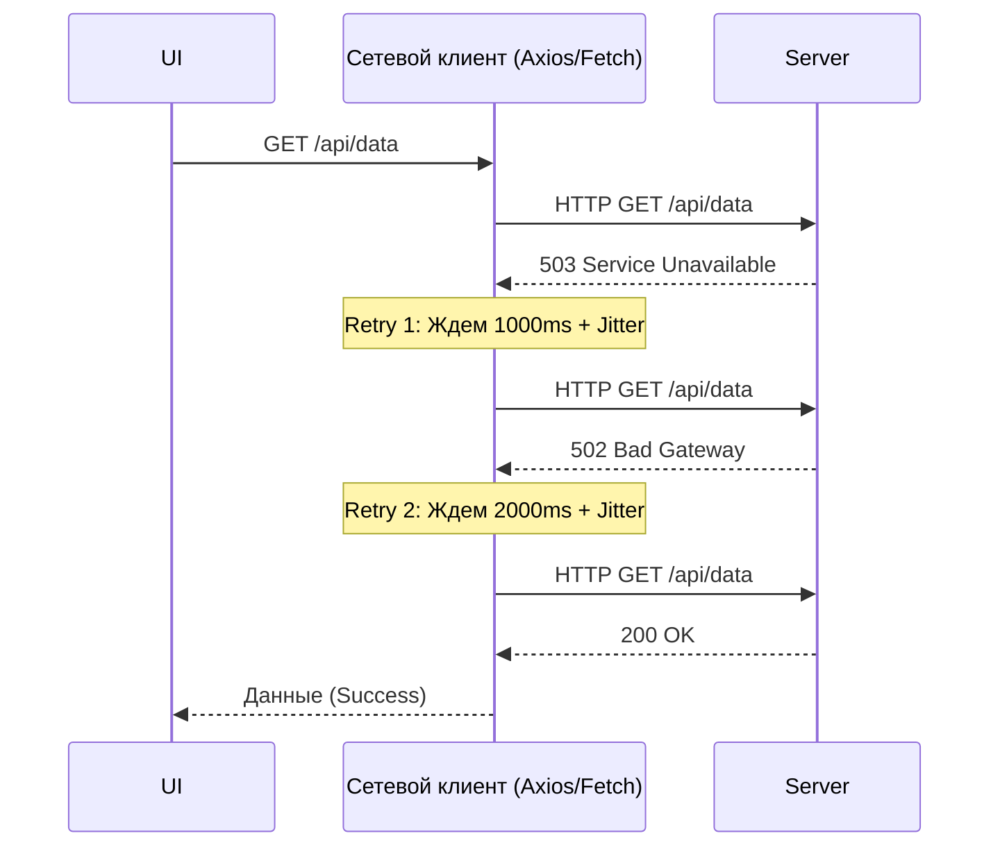

# Retry и Exponential Backoff

## Что это и какую боль решает

Любая сеть по своей природе нестабильна. Запросы могут падать из-за кратковременных сетевых аномалий, перегрузок балансировщиков, микро-отказов серверов или срабатывания Rate Limiter'ов. В большинстве случаев это временные проблемы: если отправить тот же запрос через миллисекунду или секунду, он успешно выполнится.

Если никак не обрабатывать такие ситуации, приложение будет казаться пользователю хрупким, постоянно выбрасывая непонятные красные тосты с надписью "Ошибка сети". 

**Паттерн Retry** (повтор) автоматически перезапускает упавший запрос. Однако, если тысяча клиентов одновременно начнет яростно повторять запросы к и так задыхающемуся серверу, они окончательно его уложат (проблема "Громового стада" — Thundering herd). 

Чтобы этого избежать, применяется **Backoff** (задержка) — пауза между попытками. Самый эффективный вид — **Exponential Backoff с Jitter'ом**, при котором время ожидания между попытками растет экспоненциально (1с, 2с, 4с...), а к самому времени добавляется случайная погрешность (jitter), "размазывая" нагрузку.

## Как это работает на практике

Архитектурно Retry-механизм чаще всего встраивается в сетевой клиент (например, через Interceptor в Axios или обертку над `fetch`), делая процесс абсолютно прозрачным для бизнес-логики.



## Примеры кода

### ❌ Анти-паттерн: Наивный ретрай без задержек и разбора ошибок
Просто крутить цикл при любой ошибке — верный способ выстрелить себе в ногу. Это нагружает процессор клиента, спамит сервер и может привести к дублированию действий.

```typescript
// ПЛОХО: Нет пауз, ретраим POST-запросы, ретраим 400-е ошибки
async function naiveFetch(url, options) {
  let attempts = 3;
  while (attempts > 0) {
    try {
      return await fetch(url, options); // Если сервер вернул 404, зачем повторять?
    } catch (e) {
      attempts--;
      if (attempts === 0) throw e;
    }
  }
}
```

### ✅ Best Practice: Экспоненциальный Backoff + Jitter + Идемпотентность
Грамотный ретрай учитывает статус-код (нет смысла ретраить `401 Unauthorized` или `404 Not Found`) и HTTP-метод.

```typescript
const isRetryableError = (error: AxiosError) => {
  // Ретроим только сетевые ошибки или 5xx / 429
  if (!error.response) return true; 
  return [408, 429, 500, 502, 503, 504].includes(error.response.status);
};

const isIdempotentRequest = (config: AxiosRequestConfig) => {
  // Безопасно повторять только идемпотентные методы
  return ['get', 'put', 'delete', 'head', 'options'].includes(config.method?.toLowerCase() || 'get');
};

const calculateBackoff = (attempt: number) => {
  const base = 1000; // Базовое ожидание 1 секунда
  const max = 10000; // Максимум 10 секунд
  // Экспоненциальный рост: 1000, 2000, 4000...
  const exponential = Math.min(max, base * Math.pow(2, attempt));
  // Jitter: случайное отклонение до 20%
  const jitter = exponential * 0.2 * Math.random(); 
  return exponential + jitter;
};

// Пример для Axios Interceptor (упрощенно)
axios.interceptors.response.use(undefined, async (error) => {
  const config = error.config;
  
  if (!config || !isIdempotentRequest(config) || !isRetryableError(error)) {
    return Promise.reject(error);
  }

  config.retryCount = config.retryCount ?? 0;
  
  if (config.retryCount >= 3) {
    return Promise.reject(error);
  }

  config.retryCount += 1;
  const delay = calculateBackoff(config.retryCount);
  
  await new Promise(resolve => setTimeout(resolve, delay));
  return axios(config); // Повторяем запрос
});
```

## Границы применимости и подводные камни

1. **Идемпотентность (Главное правило)**
   Никогда не используйте автоматический retry для не-идемпотентных операций (например, `POST /checkout` или `POST /transfer`), если API не поддерживает `Idempotency-Key`. Запрос мог успешно обработаться на сервере, но ответ "200 OK" потерялся в сети по пути к клиенту. Если вы сделаете retry, вы спишете деньги или создадите ресурс дважды.
2. **Проблема таймаутов UI vs Retry**
   Пользователи не любят ждать. Если базовая задержка 1 секунда, то 3 попытки (1 + 2 + 4) займут минимум 7 секунд. Для фонового сохранения черновика (silent request) это отлично. Но для запроса, который блокирует интерфейс лоадером, 7 секунд ожидания — это катастрофа. Пользователь скорее сам обновит страницу. В UI-зависимых запросах лучше делать максимум 1-2 быстрых ретрая или применять стратегию Fail-Fast.
3. **Thundering Herd и Jitter**
   Если у вас упал бэкенд на 5 секунд, все тысячи открытых клиентов одновременно получат 502 ошибку. Если у всех жестко зашита пауза в 2 секунды, через 2 секунды они *одновременно* отправят шквал запросов на только что поднявшийся сервер и убьют его снова. Jitter (случайный разброс задержки) — обязательное условие для распределенных систем, он размазывает этот спайк нагрузки во времени.
4. **Симбиоз с Circuit Breaker**
   Retry хорошо работает для мимолетных сбоев. Но если база данных лежит намертво, ретраи лишь усугубляют ситуацию, создавая бесполезную нагрузку. В зрелых системах Retry комбинируют с **Circuit Breaker** (предохранителем): если за последние X минут упало больше Y% запросов, клиент временно перестает даже пытаться слать запросы на этот эндпоинт, сразу возвращая ошибку (Fail-fast), пока "предохранитель" не остынет.
5. **Rate Limiting (429 Too Many Requests)**
   В случае получения 429 ошибки, бэкенд часто отправляет заголовок `Retry-After`. Хороший Retry-клиент должен парсить этот заголовок и устанавливать backoff строго в соответствии с требованием сервера, игнорируя свои локальные формулы экспоненты.
