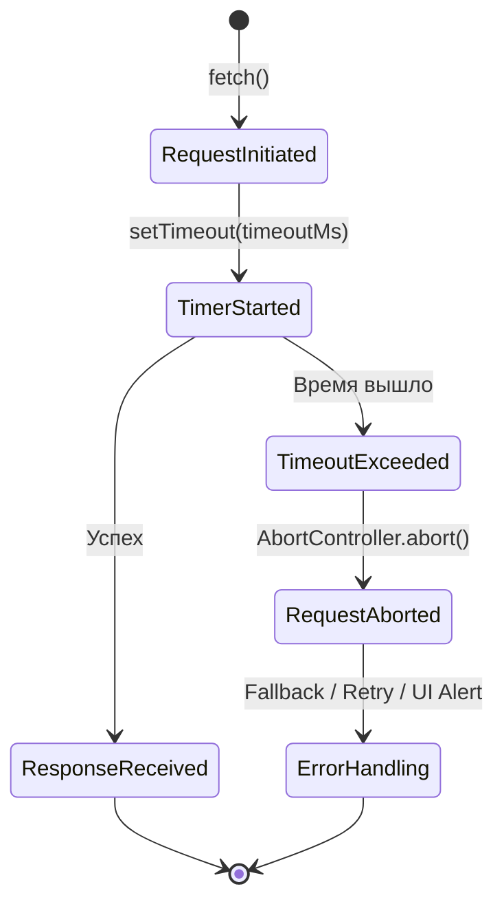

# Timeout Strategy: управление ожиданием в сетевом слое

## Что это и какую боль решает

**Timeout Strategy** — это архитектурный паттерн управления временем ожидания ответа от удаленного сервера. 

В идеальном мире сеть мгновенна, а серверы всегда отвечают. В реальности фронтенд постоянно сталкивается с "зависшими" запросами: сервер может обрабатывать тяжелый отчет дольше обычного, балансировщик нагрузки может "проглотить" пакет, или пользователь заехал в туннель, и его соединение перешло в состояние *zombie* (формально Wi-Fi/LTE подключен, но пакеты не ходят).

Боль, которую решает этот паттерн:
* **Блокировка UI**: Пользователь видит бесконечный лоадер, потому что браузер покорно ждет ответа, который никогда не придет.
* **Утечки ресурсов**: Открытые (но мертвые) соединения потребляют ресурсы браузера. Существует строгий лимит на количество одновременных запросов к одному домену (обычно около 6).
* **Каскадные сбои**: Если один критический эндпоинт "висит", он может заблокировать выполнение цепочки зависимых запросов или инициализацию всего приложения.

## Как это работает на практике

Стратегия таймаутов не монолитна. Архитектурно она делится на глобальные настройки (по умолчанию для всего приложения) и локальные (специфичные для конкретных операций, например, загрузки файлов).



Основной механизм реализации в современном вебе — это связка таймера и объекта `AbortController`, который позволяет прервать выполнение `fetch` или XHR запроса в любой момент жизненного цикла.

## Примеры реализации

### Анти-паттерн: Отсутствие таймаутов (или "бесконечная надежда")

Многие разработчики полагаются на встроенные таймауты браузера, забывая, что они могут достигать 2-5 минут.

```typescript
// ❌ ПЛОХО: Запрос может висеть очень долго, замораживая UI
async function fetchUserData() {
  const response = await fetch('/api/user/profile');
  return response.json();
}
```

### Лучшая практика: Глобальный таймаут с локальным переопределением

Грамотная архитектура сетевого слоя инкапсулирует логику таймаутов, предоставляя разработчикам удобный интерфейс с разумными значениями по умолчанию.

```typescript
// ✅ ХОРОШО: Использование AbortController и гибкая настройка
interface FetchOptions extends RequestInit {
  timeoutMs?: number;
}

const DEFAULT_TIMEOUT = 10000; // 10 секунд по умолчанию

async function fetchWithTimeout(url: string, options: FetchOptions = {}) {
  const { timeoutMs = DEFAULT_TIMEOUT, ...fetchOptions } = options;
  
  const controller = new AbortController();
  const id = setTimeout(() => controller.abort(), timeoutMs);
  
  try {
    const response = await fetch(url, {
      ...fetchOptions,
      signal: controller.signal
    });
    
    if (!response.ok) throw new Error(`HTTP Error: ${response.status}`);
    return await response.json();
  } catch (error) {
    if (error instanceof Error && error.name === 'AbortError') {
      throw new Error(`Timeout: Запрос к ${url} превысил лимит в ${timeoutMs}мс`);
    }
    throw error;
  } finally {
    // Важно: очищаем таймер, чтобы избежать утечек памяти и фантомных срабатываний
    clearTimeout(id); 
  }
}

// Использование:
// Обычный запрос (отвалится через 10 сек)
fetchWithTimeout('/api/fast-data');

// Тяжелый экспорт (даем серверу 60 сек на генерацию)
fetchWithTimeout('/api/reports/export', { timeoutMs: 60000 });
```

## Неочевидные нюансы и границы применимости

### 1. Таймауты коннекта vs Таймауты чтения
В браузере (в отличие от Node.js или нативных мобильных платформ) невозможно разделить таймаут коннекта (как долго мы пытаемся установить TCP-соединение) и таймаут чтения (как долго мы ждем первый байт или скачиваем тело ответа). `AbortController` просто прерывает весь процесс целиком.

### 2. Динамические таймауты (Adaptive Timeouts)
Для мобильных сетей (3G/EDGE) 10 секунд может быть слишком мало, а для скоростного Wi-Fi — слишком много. Продвинутая стратегия включает оценку качества сети (например, через `navigator.connection.effectiveType` Network Information API) и динамическое увеличение таймаутов для медленных соединений.

### 3. Идемпотентность и состояние "Кота Шрёдингера"
Когда прерывается POST/PUT/DELETE запрос (например, оплата или создание сущности), *мы не знаем, дошел ли запрос до сервера*. 
* **Скрытый компромисс**: Сервер мог успешно обработать запрос, но ответ не успел дойти до клиента из-за таймаута.
* **Граница применимости**: Не используйте агрессивные (короткие) таймауты для неидемпотентных операций. Если POST-запрос упал по таймауту, его слепой автоматический повтор (Retry) может привести к дублированию данных или двойному списанию средств. Требуется сверка статуса (polling) или механизмы идемпотентности на бэкенде (передача уникального `Idempotency-Key` в заголовках).

### 4. Накладные расходы (Overhead)
Создание экземпляров `AbortController` и `setTimeout` для каждого из сотен запросов в секунду может создать небольшую нагрузку на Garbage Collector. Гораздо важнее не забывать вызывать `clearTimeout` в блоке `finally`. Если запрос завершился успешно за 100мс, а таймер заведен на 10 секунд, он будет "висеть" в памяти всё это время, удерживая ссылки на контроллеры и замыкания.

### Когда это СТРОГО необходимо
* В Server-Side Rendering (SSR) приложениях (Next.js, Nuxt), где зависший запрос к микросервису заблокирует рендеринг страницы на Node.js сервере и быстро приведет к исчерпанию пула воркеров (сервер "ляжет").
* В публичном SDK (npm-пакете) вашего API, который вы предоставляете другим разработчикам.

### Когда это НЕ нужно
* При загрузке или скачивании больших бинарных файлов (видео, бандлы ресурсов), где прогресс загрузки важнее абсолютного времени. В таких случаях лучше опираться на трекинг прогресса и обрывать соединение, только если прогресс (скорость скачивания) падает до нуля на определенное время (так называемый *Stall Timeout*).
