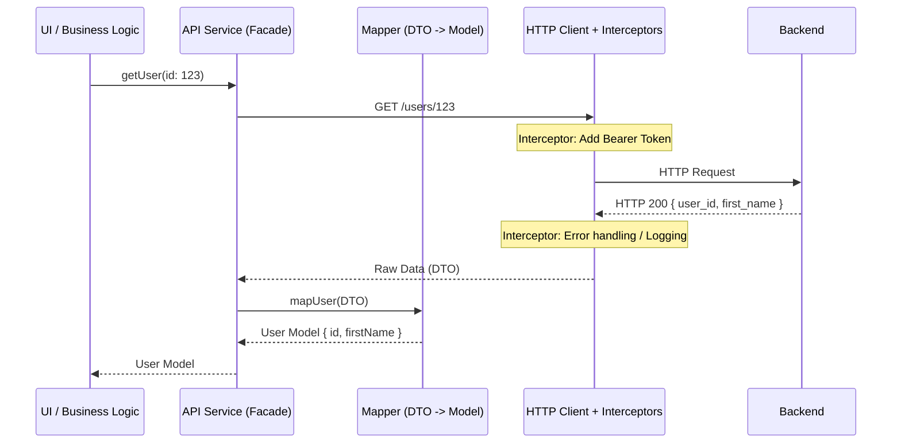

# Архитектура API Client

## Что это и какую проблему решает

В любом современном frontend-приложении рано или поздно наступает момент, когда простые вызовы `fetch` или `axios.get` разбросаны по всем компонентам. Это приводит к дублированию логики авторизации, обработки ошибок, форматирования и маппинга данных. 

**API Client** — это централизованный архитектурный слой, который инкапсулирует всю логику работы с сетью. Он действует как единая точка входа для общения с бекендом, скрывая детали транспортного протокола (HTTP/REST, GraphQL, WebSocket) от бизнес-логики и UI.

## Как это работает на практике

Хороший API Client строится по принципу слоеной архитектуры (луковицы), где каждый слой выполняет свою специфичную задачу:

1. **Транспортный слой (HTTP Client)** — базовая обертка над `fetch` или `axios`. Отвечает за настройку соединения (Base URL, Timeout).
2. **Слой перехватчиков (Interceptors)** — мидлвары для модификации запросов (например, добавление токенов) и ответов (глобальная обработка 401, refresh token механика).
3. **Слой фасадов (API Services)** — предметно-ориентированные методы (`getUser`, `createOrder`), которые используют настроенный HTTP клиент.
4. **Слой адаптеров (DTO Mappers)** — преобразование контрактов бекенда (DTO) в удобные для клиента модели данных.

### Визуализация потока данных



## Примеры реализации

### Антипаттерн: Прямой вызов в компоненте

Связывание UI и деталей сети. Такой код сложно тестировать, невозможно переиспользовать и очень больно рефакторить при изменениях на бэкенде.

```typescript
// ❌ Плохо: логика сети, токенов и UI в одном месте
async function fetchUserData() {
  const token = localStorage.getItem('token');
  try {
    const response = await fetch('https://api.example.com/users/me', {
      headers: { Authorization: `Bearer ${token}` }
    });
    if (response.status === 401) {
      // логика логаута размазывается по компонентам
    }
    const data = await response.json();
    setUser({ id: data.user_id, name: data.first_name });
  } catch (error) {
    showError(error);
  }
}
```

### Best Practice: Разделение ответственности

Создаем настроенный инстанс клиента и используем его в изолированных сервисах.

```typescript
// 1. Core HTTP Client (например, axios)
const apiClient = axios.create({
  baseURL: 'https://api.example.com',
  timeout: 5000,
});

// Interceptors для токенов
apiClient.interceptors.request.use((config) => {
  const token = getToken();
  if (token) config.headers.Authorization = `Bearer ${token}`;
  return config;
});

// 2. Mapper
const mapUserDTOToModel = (dto: UserDTO): User => ({
  id: dto.user_id,
  firstName: dto.first_name,
});

// 3. API Service
export const UserApi = {
  getMe: async (): Promise<User> => {
    const { data } = await apiClient.get<UserDTO>('/users/me');
    return mapUserDTOToModel(data);
  }
};

// ✅ Хорошо: В компоненте или сторе мы вызываем только чистый сервис
const user = await UserApi.getMe();
```

## Неочевидные нюансы и границы применимости

### 1. Проблема толстого клиента (God Object)
Часто разработчики сливают все методы в один гигантский объект `API` или класс. Это приводит к конфликтам при слиянии веток и разрастанию бандла (если не настроен tree-shaking).
**Решение:** Разделяйте сервисы по доменам (`UserApi`, `OrderApi`, `CatalogApi`).

### 2. Цена мапперов (Overhead)
Маппинг DTO в модели защищает приложение от изменений контрактов бекенда. Однако писать мапперы для каждой CRUD-сущности — долго и дорого. 
**Когда применять:** Обязательно используйте адаптеры, если бэкенд отдает "грязные" данные (snake_case вместо camelCase, неконсистентные форматы дат) или если контракт нестабилен. 
**Когда НЕ применять:** В небольших проектах или если у вас монорепозиторий со строгой типизацией (например, tRPC), где бэкенд и фронтенд разделяют одни и те же типы, маппинг может быть избыточным.

### 3. Дублирование состояния (Кэш vs Стор)
С появлением таких библиотек, как React Query, SWR или RTK Query, часть традиционной ответственности API Client (кэширование, дедупликация запросов, retry-логика) переходит в Data Fetching слой. 
В такой парадигме API Client должен оставаться максимально "глупым" (stateless) — он просто выполняет promise-запрос, а управлять состоянием и кэшем этого запроса должен специализированный инструмент.

### 4. Отмена запросов (AbortController)
В сложных SPA критически важно уметь отменять предыдущие запросы при частой смене страниц или вводе текста (debounce search). Архитектура API Client должна явно поддерживать проброс `AbortSignal` с самого верхнего уровня вызова (компонента) до транспортного слоя, иначе сеть будет забита неактуальными запросами.
