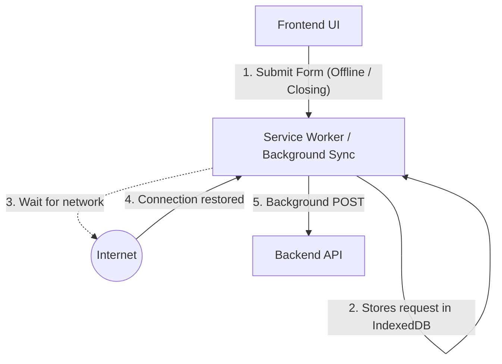

# Background Requests (Фоновые запросы)

Background Requests — это сценарий выполнения сетевых операций, не блокирующих основной пользовательский интерфейс и часто работающих незаметно для пользователя. Они могут выполняться даже тогда, когда вкладка приложения неактивна или закрыта.

Боль, которую мы решаем: хрупкость процессов, привязанных к жизненному циклу компонента или вкладки. Представьте, что юзер прикрепляет 50мб видео к письму и случайно закрывает вкладку или переходит на другой маршрут (component unmount). Запрос обрывается, видео не загружено. Нам нужен механизм надежной доставки данных, независимый от того, куда кликает пользователь.



### Как это работает на практике
Во фронтенде фоновые запросы реализуются на двух уровнях:
1. **Application Level (Фоновый стейт)**: Обычные запросы, которые вынесены из стейта компонентов в глобальный стейт (Redux/Zustand) или специализированный менеджер (React Query mutations). Даже если компонент "Модалка" размонтировался, загрузка файла продолжается.
2. **OS/Browser Level (Service Workers)**: Использование Background Sync API или Fetch KeepAlive. Это позволяет браузеру завершить запрос даже если пользователь полностью закрыл страницу.

### Пример (Антипаттерн vs Правильное решение)

**Антипаттерн (Привязка к компоненту)**:
```tsx
function FeedbackForm() {
  const submit = async () => {
    await fetch('/api/feedback', { method: 'POST' });
    // Если юзер закрыл модалку до завершения await, запрос может прерваться браузером
  };
  return <button onClick={submit}>Send</button>;
}
```

**Правильное решение (API `keepalive`)**:
Если нам нужно отправить аналитику или небольшой лог при закрытии страницы (или уходе со страницы).
```typescript
window.addEventListener('unload', () => {
  // Флаг keepalive заставляет браузер держать HTTP-соединение 
  // открытым и дослать данные, даже когда вкладка уже мертва.
  fetch('/api/analytics', {
    method: 'POST',
    body: JSON.stringify({ event: 'page_exit' }),
    keepalive: true 
  });
});
```

### Неочевидные нюансы и трейдоффы
1. **Background Sync API**: Идеально подходит для PWA (прогрессивных веб-приложений), работающих в offline-режиме (например, чат в метро). Сообщения складываются в IndexedDB сервис-воркером, и как только появляется интернет (даже если телефон в кармане, а вкладка закрыта), воркер "просыпается" и шлет запросы. Минус — слабая поддержка в iOS (Safari).
2. **Beacon API**: Для фоновой аналитики раньше использовали `navigator.sendBeacon()`. Сейчас `fetch` с флагом `keepalive` покрывает те же кейсы и является более гибким. Оба имеют жесткое ограничение: нельзя отправить большой объем данных (обычно до 64 КБ).
3. **Глобальный фидбек**: Если вы перенесли загрузку тяжелого файла в фон, вы обязаны предоставить глобальный UI для отображения прогресса (например, маленькая плашка "Загрузка 1/3 файлов..." в углу экрана), иначе пользователь подумает, что ничего не произошло, и нажмет кнопку еще 5 раз.
