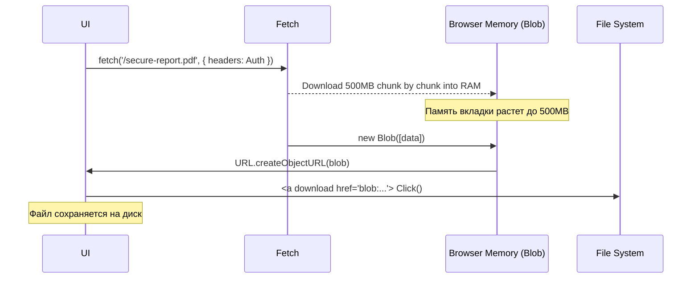

# File Download (Скачивание файлов)

Скачивание файлов во фронтенде кажется тривиальной задачей: просто дай ссылку `<a href="/file.pdf">`, и браузер всё сделает сам. Однако всё ломается, как только файл генерируется динамически, требует передачи JWT-токена в заголовках (Authorization) или весит несколько гигабайт.

Боль, которую мы решаем: браузерный менеджер загрузок не умеет отправлять кастомные HTTP-заголовки (Bearer токены). Если попытаться скачать секьюрный файл через `window.open(url)` или `<a href>`, сервер вернет 401 Unauthorized. Приходится качать файл "руками" через AJAX (`fetch`), сохранять в память браузера (RAM) и затем "выплевывать" пользователю.



### Как это работает на практике
Классический подход с токеном: мы делаем `fetch` или `axios.get` с `responseType: 'blob'`. Браузер выкачивает бинарные данные в память. Мы создаем из них виртуальную ссылку `blob:http://localhost/uuid` через `URL.createObjectURL()`, создаем скрытый тег `<a>`, имитируем клик по нему, и браузер предлагает сохранить файл на диск.

### Пример кода (Правильное скачивание защищенного файла)
```typescript
async function downloadSecureFile(fileId: string, filename: string) {
  try {
    const response = await fetch(`/api/files/${fileId}`, {
      headers: { 'Authorization': `Bearer ${localStorage.token}` }
    });
    
    // 1. Читаем тело как бинарник (Blob)
    const blob = await response.blob();
    
    // 2. Создаем временный URL в памяти
    const url = window.URL.createObjectURL(blob);
    
    // 3. Создаем невидимую ссылку и кликаем
    const a = document.createElement('a');
    a.href = url;
    a.download = filename; // Подсказка браузеру, как назвать файл
    document.body.appendChild(a);
    a.click();
    
    // 4. Убираем за собой мусор (ОЧЕНЬ ВАЖНО для памяти!)
    a.remove();
    window.URL.revokeObjectURL(url);
  } catch (error) {
    console.error("Download failed", error);
  }
}
```

### Неочевидные нюансы и трейдоффы
1. **Утечки памяти и OOM (Out Of Memory)**: Скачивание через Blob выкачивает ВЕСЬ файл в оперативную память браузера. Если вы попробуете скачать так видео на 2 ГБ, вкладка Chrome просто крашнется (особенно на мобильных). 
2. **Как качать огромные защищенные файлы?** 
   - *Паттерн One-time Token*: Фронтенд делает легкий AJAX запрос за временным токеном (`/api/files/1/ticket`). Сервер возвращает ticket (живет 30 сек). Фронтенд делает `window.open('/api/files/1?ticket=xyz')`. Браузер качает напрямую на диск!
   - *File System Access API*: Позволяет писать стрим из `fetch` напрямую на жесткий диск кусками, минуя RAM. Работает только в современных десктопных Chromium.
3. **Имя файла**: Если вы не знаете имя файла заранее, его можно вытащить из заголовка ответа сервера `Content-Disposition: attachment; filename="report_2023.pdf"`. Внимание: бекенд должен разрешить этот заголовок в CORS (`Access-Control-Expose-Headers`).
