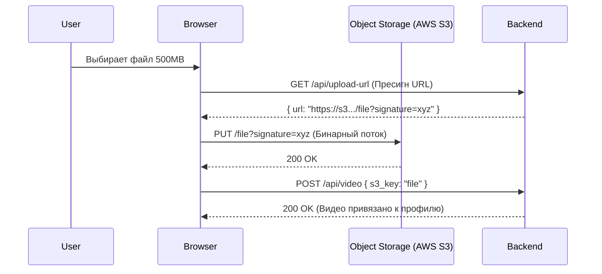

# File Upload (Загрузка файлов)

Загрузка файлов на сервер — это классическая задача, которая из простой отправки картинки профиля часто перерастает в инженерию с прогресс-барами, отменами, ресайзом на клиенте и стриминговой загрузкой гигабайтных видео кусками (chunking).

Боль, которую мы решаем: стандартные JSON API не предназначены для отправки файлов. Попытка перевести 100МБ картинку в Base64 строку и отправить в JSON `{"avatar": "base64..."}` увеличит размер запроса на 33% и убьет оперативную память (как клиента, так и сервера) во время парсинга. Файлы нужно передавать как бинарные потоки.



### Как это работает на практике
1. **Multipart/form-data**: Классический подход. Файл и другие текстовые поля формы упаковываются в специальный формат с "границами" (boundaries). Идеально для небольших файлов (до 20МБ).
2. **Direct Upload (Presigned URLs)**: Современный подход для больших файлов. Фронтенд спрашивает у бекенда разрешение на загрузку, получает уникальный подписанный URL прямо в облако (S3 / GCS). Фронтенд отправляет файл в облако напрямую, минуя бекенд, разгружая наши сервера от тяжелого бинарного трафика.

### Пример кода (Классический Multipart с прогрессом)

Обычный `fetch` не умеет отслеживать прогресс загрузки (Upload Progress). Для этого приходится спускаться на уровень `XMLHttpRequest` или использовать `axios`.

```typescript
// Использование Axios для отслеживания прогресса
async function uploadFile(file: File) {
  const formData = new FormData();
  formData.append('avatar', file); // 'avatar' - имя поля, которое ждет бекенд
  formData.append('userId', '123'); // Можно прикрепить и текст

  await axios.post('/api/upload', formData, {
    // ВАЖНО: Не ставьте Content-Type руками! Axios и браузер сами 
    // поставят 'multipart/form-data; boundary=----WebKitFormBoundary...'
    
    onUploadProgress: (progressEvent) => {
      const percentCompleted = Math.round(
        (progressEvent.loaded * 100) / (progressEvent.total || file.size)
      );
      console.log(`Загружено: ${percentCompleted}%`);
      // updateUI(percentCompleted)
    }
  });
}
```

### Неочевидные нюансы и трейдоффы
1. **Предварительная обработка (Client-side Resize)**: Если юзер грузит фотографию 4K с iPhone (15 МБ) для аватарки 100x100 пикселей, отправлять оригинал глупо. В архитектуру фронтенда часто добавляют слой обработки (например, Canvas API или WASM), который сжимает картинку и конвертирует её в WebP перед отправкой.
2. **Chunked Upload (Загрузка кусками)**: Загружая видео на 5 ГБ одним запросом, при обрыве интернета на 99% придется качать всё заново. Решение — дробить файл во фронтенде (через `file.slice()`) на куски по 5МБ и отправлять их параллельно/последовательно. Если один упадет — ретраим только его (Tus protocol).
3. **Безопасность (MIME Spoofing)**: Фронтенд может проверить `file.type` (например `image/png`), но хакер может переименовать `virus.exe` в `virus.png`, и браузер поверит расширению. Валидация типов (MIME-sniffing) должна обязательно происходить на бекенде!
