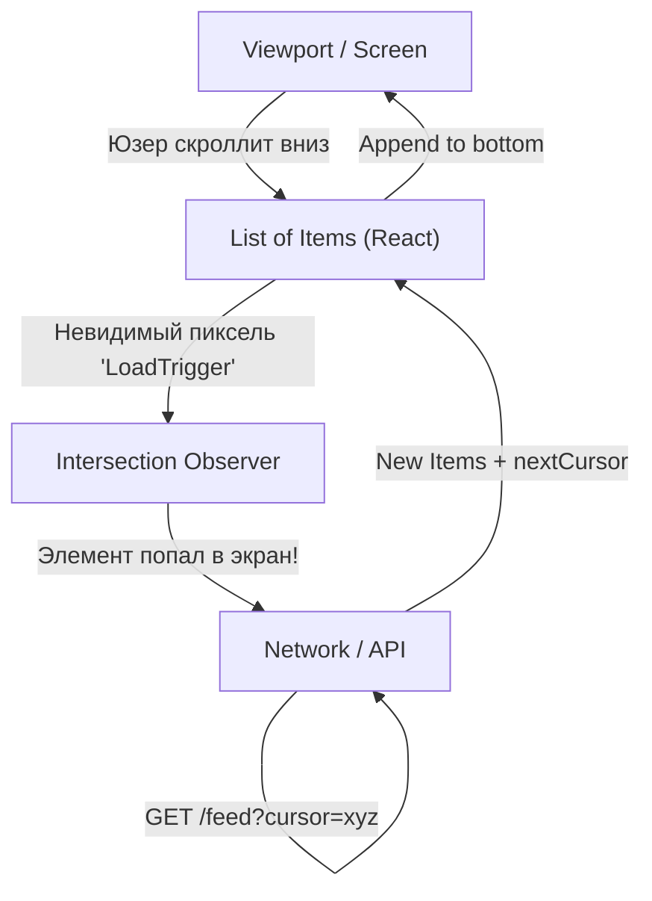

# Infinite Scroll (Бесконечный скролл)

Бесконечный скролл — это UX-паттерн и стратегия загрузки данных, при которой новые элементы подгружаются автоматически по мере приближения пользователя к концу списка (или страницы), создавая иллюзию бесконечной ленты (как в TikTok, Twitter, Instagram).

Боль, которую мы решаем: классическая пагинация по страницам (1, 2, 3...) требует от пользователя лишних кликов и прерывает состояние потока (Flow). Если цель интерфейса — удержание внимания и непрерывное потребление контента, бесконечный скролл работает лучше всего.



### Как это работает на практике
Во фронтенде в самый низ списка помещается невидимый `div` (или спиннер). Мы "наблюдаем" за ним с помощью нативного браузерного API — `IntersectionObserver`. Как только этот элемент появляется в видимой области экрана (Viewport), запускается функция-обработчик, которая делает запрос к API за следующей порцией данных. Новые данные приклеиваются в конец массива.

### Пример кода (Правильное решение с IntersectionObserver)

**Антипаттерн**: Использовать `window.addEventListener('scroll')`. Это вызывает сотни событий в секунду, сильно нагружая Main Thread, и требует сложной математики расчета отступов.

**Правильное решение**:
```tsx
import { useEffect, useRef, useState } from 'react';

function Feed() {
  const [items, setItems] = useState([]);
  const [page, setPage] = useState(1);
  const loaderRef = useRef<HTMLDivElement>(null);

  useEffect(() => {
    // 1. Создаем наблюдателя
    const observer = new IntersectionObserver((entries) => {
      // Если элемент-триггер пересек границу экрана
      if (entries[0].isIntersecting) {
        setPage((prev) => prev + 1); // Триггерим загрузку
      }
    });

    if (loaderRef.current) observer.observe(loaderRef.current);
    return () => observer.disconnect();
  }, []);

  useEffect(() => {
    // 2. Сама загрузка
    fetch(`/api/feed?page=${page}`)
      .then(r => r.json())
      .then(newItems => setItems(prev => [...prev, ...newItems]));
  }, [page]);

  return (
    <div>
      {items.map(item => <Post key={item.id} data={item} />)}
      {/* 3. Невидимый триггер в самом конце списка */}
      <div ref={loaderRef} style={{ height: '20px' }}>Loading...</div>
    </div>
  );
}
```

### Неочевидные нюансы и трейдоффы
1. **DOM Bloat (Раздувание DOM)**: Если пользователь будет скроллить 30 минут, в DOM накопится 10 000 тяжелых компонентов. Страница начнет жестко тормозить, а потребление памяти улетит в космос. Решение — комбинация Infinite Scroll и **Virtualization (Windowing)**. Элементы, которые ушли наверх за пределы экрана, должны удаляться из DOM, заменяясь пустыми блоками нужной высоты (библиотеки типа `react-virtualized` или `tanstack/virtual`).
2. **Проблема Футера**: Если у вас на сайте есть полезная информация в футере (контакты, правила), бесконечный скролл — зло. Пользователь будет отчаянно пытаться доскроллить до подвала, но лента будет постоянно отталкивать его новыми постами. Решение — кнопка "Загрузить еще" или остановка автоматического скролла после 3-5 подгрузок.
3. **Навигация назад (Scroll Restoration)**: Юзер проскроллил 100 постов, кликнул на 101-й пост, а потом нажал кнопку "Назад" в браузере. В идеале он должен вернуться точно на то же место. Если вы просто сбросите стейт в пустой массив, вы выбесите пользователя. Эту проблему элегантно решают библиотеки кэширования вроде React Query (`useInfiniteQuery`).
