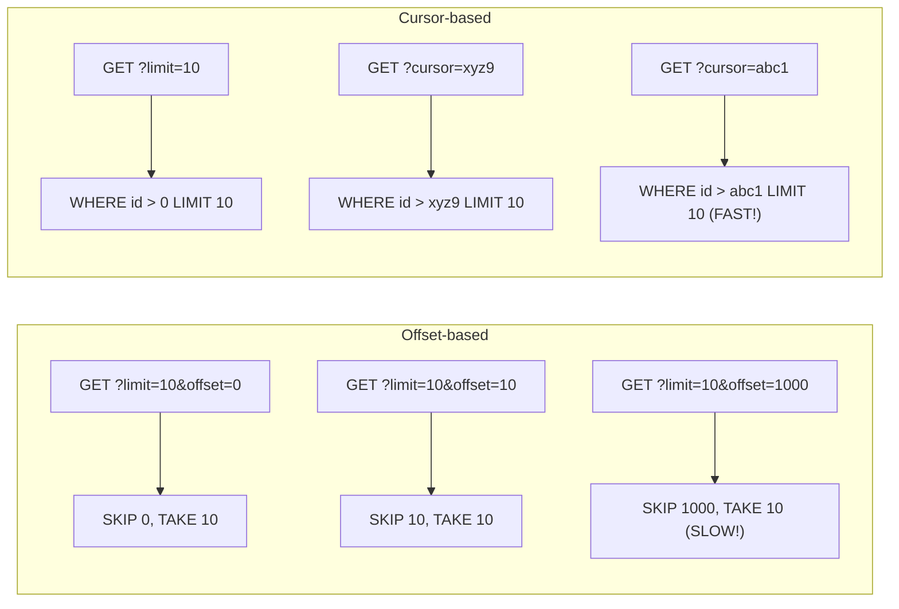

# Pagination (Пагинация)

Пагинация — это архитектурный паттерн разбиения большого массива данных на небольшие управляемые "страницы" или "куски" (chunks). Это необходимо как для защиты базы данных на бекенде, так и для защиты оперативной памяти (и DOM-дерева) браузера клиента.

Боль, которую мы решаем: попытайтесь запросить миллион записей `GET /users` одним запросом. Сервер будет выгребать их из БД несколько минут, JSON составит 500 МБ, браузер зависнет при попытке сделать `JSON.parse()`, а вкладка крашнется из-за OOM (Out Of Memory). Данные всегда нужно отдавать порциями.



### Как это работает на практике
Существует два фундаментально разных подхода к пагинации:
1. **Offset/Limit пагинация (Страничная)**: Мы запрашиваем "Дай 10 элементов, пропустив первые 50". На фронтенде обычно рисуются кнопки `[1] [2] [3] ... [10]`.
2. **Cursor пагинация (Курсорная)**: Мы запрашиваем "Дай 10 элементов, которые идут *после* элемента с ID=XYZ". Обычно используется для кнопок "Загрузить еще" или Бесконечного скролла.

### Пример (Антипаттерн Offset vs Правильный Cursor для ленты)

**Проблема Offset-пагинации**: Вы находитесь на 1 странице ленты новостей. В этот момент кто-то публикует новую новость. Все новости сдвигаются вниз. Вы переходите на 2 страницу (`offset=10`), и последняя новость с первой страницы снова показывается вам на второй странице (дубликат!). Кроме того, на бекенде (в SQL) глубокий `OFFSET 10000` работает невероятно медленно.

**Правильное решение (Cursor Pagination)**:
Бекенд возвращает вместе с данными `next_cursor` (обычно это зашифрованный ID последнего элемента или метка времени).

```typescript
function loadMore(currentCursor: string) {
  fetch(`/api/posts?limit=10&cursor=${currentCursor}`)
    .then(res => res.json())
    .then(data => {
      // data.items - новые посты
      // data.nextCursor - строка 'post_99' для следующего запроса
      appendItems(data.items);
      setNextCursor(data.nextCursor);
    });
}
```

### Неочевидные нюансы и трейдоффы
1. **Невозможность прыжков (Cursor)**: Если вы используете курсорную пагинацию, вы не можете нарисовать пользователю кнопку "Перейти сразу на 50-ю страницу", потому что вы не знаете курсор, который находится перед 50-й страницей. Юзер может двигаться только "Вперед" или "Назад".
2. **Total Count (Количество)**: В Offset-пагинации сервер обычно возвращает `total_count: 500`, чтобы фронтенд мог нарисовать `500 / 10 = 50 страниц`. Вычисление точного `total_count` в SQL (через `COUNT(*)`) на огромных таблицах — очень дорогая операция. Часто бекенд возвращает приблизительное число или не возвращает его вообще.
3. **Кеширование**: Инвалидация кеша пагинированных данных — боль. Если вы закешировали страницы 1, 2 и 3 в Redux, а потом удалили элемент на странице 1, все последующие страницы "поедут" (сдвинутся). Проще сбросить весь кеш и перезапросить первую страницу.
