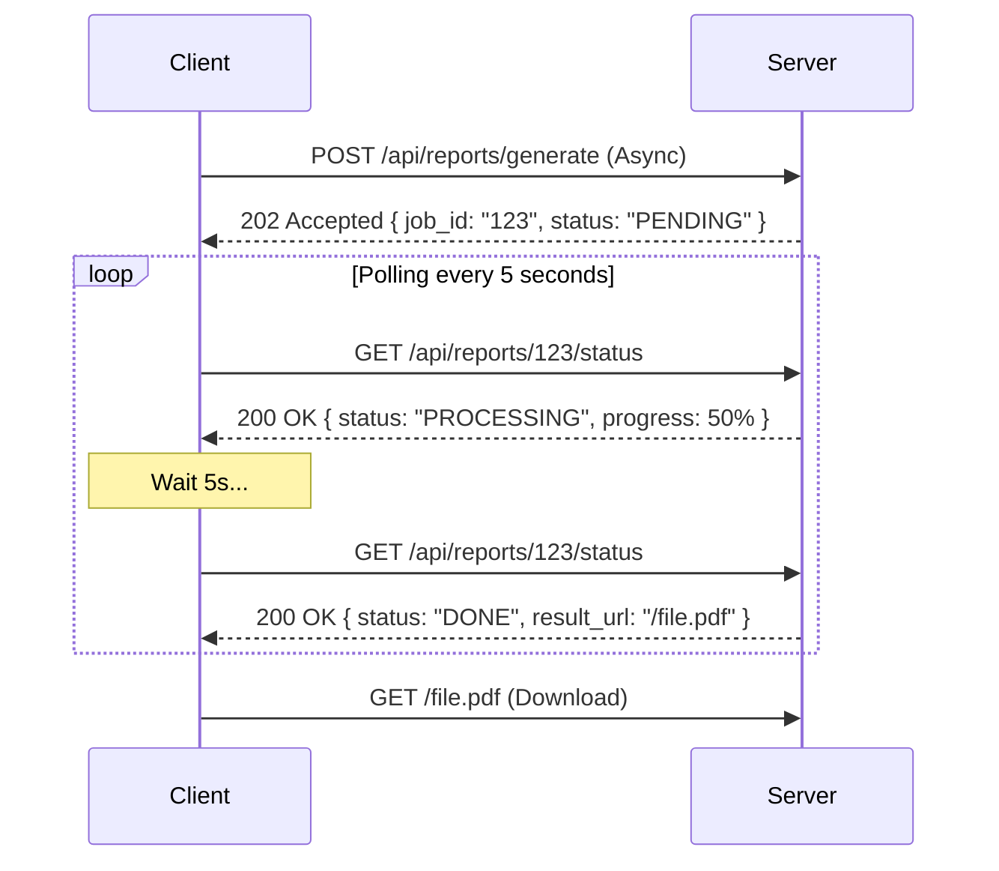

# Polling (Опрос сервера)

Polling (Поллинг) — это стратегия получения обновлений данных, при которой клиентское приложение (фронтенд) периодически, через заданные интервалы времени, отправляет HTTP-запросы на сервер, чтобы узнать: "Не появилось ли чего нового?".

Боль, которую мы решаем: отсутствие WebSockets (или нецелесообразность их внедрения). Допустим, мы запустили генерацию отчета на сервере, которая занимает 2 минуты. Держать HTTP-соединение открытым 2 минуты нельзя (порвется по таймауту). Разворачивать Redis и Socket.io ради одной фичи "статус отчета" — слишком дорого и долго. Проще просто спрашивать сервер раз в 5 секунд.



### Как это работает на практике
Существует два вида поллинга:
1. **Short Polling (Короткий опрос)**: Классический `setInterval()`. Каждые 5 секунд шлем запрос. Если данных нет, сервер сразу отвечает пустым результатом (или статусом PENDING).
2. **Long Polling (Длинный опрос)**: Клиент шлет запрос, но если данных нет, сервер *не отвечает сразу*, а "держит" соединение открытым (например, 30 секунд), пока данные не появятся. Если за 30 сек ничего не произошло, возвращается пустой ответ, и клиент немедленно шлет новый запрос.

### Пример кода (Правильное решение с Short Polling)

**Антипаттерн**: Использовать `setInterval` без обработки наложений (когда предыдущий запрос еще не успел завершиться из-за медленного интернета, а мы уже шлем новый).

**Правильное решение**: Использовать рекурсивный `setTimeout` или инструменты вроде React Query.
```tsx
import { useQuery } from '@tanstack/react-query';

function ReportStatus({ jobId }) {
  const { data } = useQuery({
    queryKey: ['report', jobId],
    queryFn: () => fetch(`/api/reports/${jobId}`).then(r => r.json()),
    
    // Вся магия поллинга в одной строчке:
    refetchInterval: (data) => {
      // Если отчет готов или упал с ошибкой - останавливаем поллинг!
      if (data?.status === 'DONE' || data?.status === 'ERROR') {
        return false; 
      }
      return 5000; // Иначе опрашиваем каждые 5 секунд
    },
  });

  if (data?.status === 'DONE') return <a href={data.url}>Скачать!</a>;
  return <Spinner progress={data?.progress} />;
}
```

### Неочевидные нюансы и трейдоффы
1. **Убийство серверов (DDoS)**: Если у вас миллион пользователей откроют вкладку и будут опрашивать сервер каждую секунду, база данных (и ваш бюджет на сервера) умрут. Интервал должен быть разумным (3-10 секунд).
2. **Экспоненциальное затухание (Backoff)**: Если юзер свернул вкладку (но не закрыл), глупо продолжать поллинг с высокой частотой. Хороший паттерн — увеличивать интервал: сначала 5 секунд, через минуту — 10 секунд, через 10 минут — раз в минуту. Браузерные API (Page Visibility API) позволяют полностью ставить поллинг на паузу, когда вкладка неактивна.
3. **Гонка состояний (Long Polling)**: Long Polling сильно нагружает балансировщики нагрузки (Load Balancers), так как они вынуждены держать десятки тысяч открытых "висящих" HTTP/1.1 соединений. В современной архитектуре Long Polling почти полностью вытеснен Server-Sent Events (SSE) или WebSockets.
