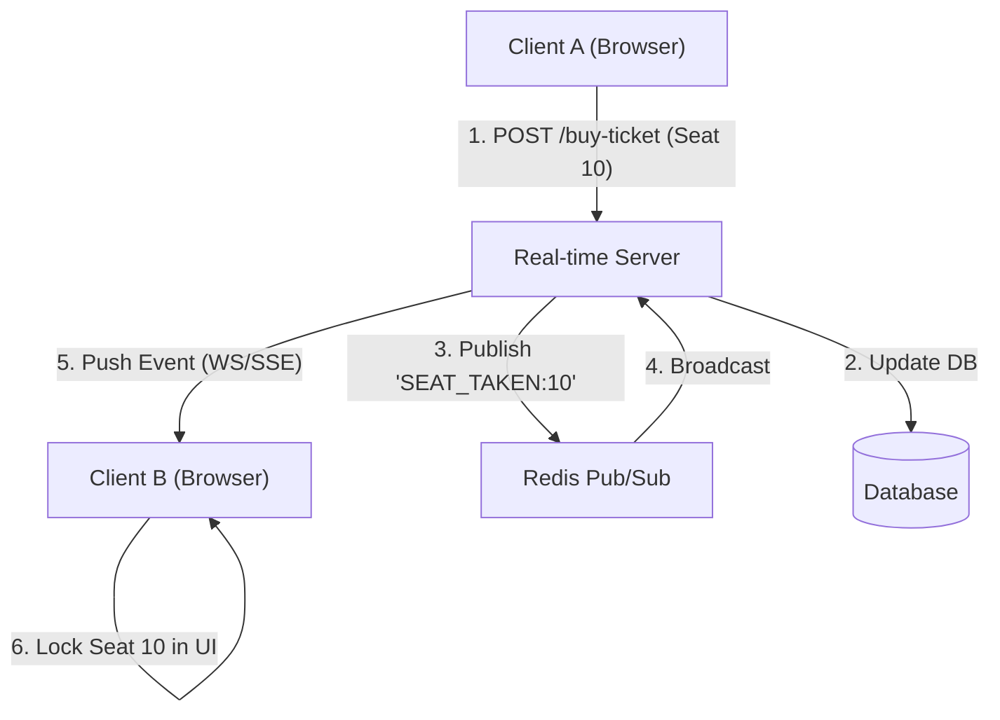

# Real-Time Updates (Обновления в реальном времени)

Обновления в реальном времени — это архитектурный паттерн, обеспечивающий мгновенную синхронизацию состояния клиента (UI) с сервером. В отличие от классического веба, где пользователь должен нажать F5 для получения новых данных, Real-Time приложения реактивно реагируют на изменения, происходящие на сервере (сообщения в чате, изменение цены биткоина, курсор другого пользователя в Figma).

Боль, которую мы решаем: рассинхронизация стейта. Представьте приложение для покупки билетов в кино. Пользователь выбирает место, но пока он вводит данные карты (3 минуты), кто-то другой уже купил это место. Если интерфейс не обновится в реальном времени и не заблокирует кресло, транзакция упадет в самом конце, что приведет к ужасному UX.



### Как это работает на практике
В современной фронтенд-архитектуре Real-Time реализуется через три основных протокола:
1. **WebSockets**: Двунаправленный канал (идеально для чатов и мультиплеера).
2. **Server-Sent Events (SSE)**: Однонаправленный пуш от сервера клиенту (идеально для уведомлений и тикеров цен).
3. **HTTP Long Polling**: Устаревший фоллбек, если прокси-серверы блокируют WS/SSE.

Главная проблема во фронтенде — не получить данные по сокету, а **правильно слить (merge) их с существующим стейтом** (Redux/Zustand), не сломав при этом рендер и не заблокировав UI.

### Пример кода (Интеграция Real-Time с React Query)

Вместо того чтобы держать логику сокетов внутри компонентов, мы подписываемся на события на глобальном уровне и инвалидируем/обновляем кеш.

```typescript
import { useQueryClient } from '@tanstack/react-query';
import { useEffect } from 'react';
import { socket } from './api/socket';

export function useRealTimeOrders() {
  const queryClient = useQueryClient();

  useEffect(() => {
    // Подписываемся на событие "Создан новый заказ"
    const handleNewOrder = (newOrder) => {
      // 1. Оптимистичное обновление (добавляем в кеш мгновенно)
      queryClient.setQueryData(['orders'], (oldOrders: any[]) => {
        return [newOrder, ...oldOrders];
      });
    };

    // Подписываемся на событие "Заказ удален"
    const handleOrderDeleted = (orderId) => {
      // 2. Инвалидация (заставляем React Query перекачать список с бекенда)
      // Надежнее, чем руками вырезать элемент из массива, если есть сложная сортировка/пагинация.
      queryClient.invalidateQueries({ queryKey: ['orders'] });
    };

    socket.on('order:created', handleNewOrder);
    socket.on('order:deleted', handleOrderDeleted);

    return () => {
      socket.off('order:created', handleNewOrder);
      socket.off('order:deleted', handleOrderDeleted);
    };
  }, [queryClient]);
}
```

### Неочевидные нюансы и трейдоффы
1. **Offline и Reconnection**: Когда пользователь заходит в туннель (интернет пропадает), сокет закрывается. Когда интернет появляется, сокет переподключается. В этот промежуток (например 2 минуты) могли произойти важные события. Вы **обязаны** при каждом успешном реконнекте (reconnect) делать обычный HTTP GET запрос (Sync), чтобы подтянуть то, что пропустили! Сокеты не гарантируют доставку сообщений, пока были отключены.
2. **Порядок сообщений (Message Ordering)**: В распределенных системах сообщение "Заказ обновлен" может прийти по сокету быстрее, чем ответ на HTTP POST запрос "Создать заказ". Если ваш UI не готов к такой гонке данных, он крашнется (попытается обновить заказ, которого еще нет в сторе). Все сущности должны иметь `version` или `updatedAt` для разрешения конфликтов.
3. **Throttling UI**: Если с сервера летит 100 обновлений в секунду (например, график крипты), не пытайтесь вызывать `setState` на каждое сообщение. Реакт умрет от ререндеров. Обновления нужно дросселировать (Throttle) и накапливать в батчи, отрисовывая пачкой 1-2 раза в секунду.
