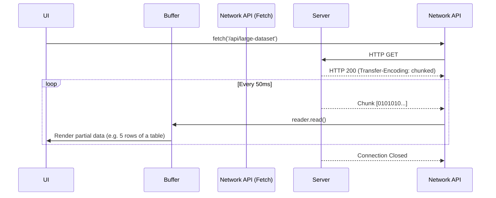

# Streaming (Стриминг данных)

Стриминг во фронтенде — это паттерн получения или отправки данных непрерывным потоком (частями/чанками), вместо ожидания полной загрузки всего объема информации. 

Боль, которую мы решаем: огромные файлы и Time To First Byte (TTFB). Если вы запросите с сервера видеофайл размером 2 ГБ обычным `fetch().then(res => res.blob())`, браузер зависнет на 10 минут, скачает все 2 ГБ в оперативную память и только потом позволит вам начать просмотр. Стриминг позволяет начать отрисовку/воспроизведение первой секунды видео (или первого абзаца текста от LLM) сразу после получения первого мегабайта.



### Как это работает на практике
Современный стандарт веба — **Streams API**. Он позволяет работать с потоками через интерфейсы `ReadableStream` (для чтения ответа) и `WritableStream` (для отправки данных).
Самые популярные юзкейсы стриминга во фронтенде:
1. **Медиа-стриминг (HLS / DASH)**: Видео разбивается на мелкие файлы (сегменты) по 2-10 секунд. Браузерный плеер качает сегмент, кладет в буфер (Media Source Extensions - MSE) и проигрывает, пока качается следующий.
2. **Text Streaming (LLM / ChatGPT)**: Получение генерации нейросети по словам (через Server-Sent Events или Fetch Streams).
3. **NDJSON (Newline Delimited JSON)**: Обычный JSON нельзя распарсить до его полного завершения. NDJSON позволяет присылать по одному JSON-объекту на каждой новой строке.

### Пример кода (Стриминг огромного списка NDJSON)
Вместо того чтобы ждать загрузки массива из 100,000 логов, мы парсим каждую строку по мере поступления и сразу показываем в UI.

```typescript
async function streamLogs() {
  const response = await fetch('/api/logs.ndjson');
  // Получаем ридер из потока ответа
  const reader = response.body?.getReader();
  const decoder = new TextDecoder();
  let buffer = '';

  if (!reader) return;

  while (true) {
    const { done, value } = await reader.read();
    if (done) break;

    // Декодируем байты в строку
    buffer += decoder.decode(value, { stream: true });
    
    // Бьем строку по переносам \n
    const lines = buffer.split('\n');
    // Последняя линия может быть неполной, оставляем ее в буфере
    buffer = lines.pop() || ''; 

    for (const line of lines) {
      if (line.trim()) {
        const logEntry = JSON.parse(line);
        // Обновляем UI по одному элементу мгновенно!
        appendLogToTerminal(logEntry); 
      }
    }
  }
}
```

### Неочевидные нюансы и трейдоффы
1. **Буферизация прокси-серверов**: Самая частая проблема стриминга. Вы настроили стриминг в коде, запускаете локально — всё работает плавно. Выкатываете на продакшен — стриминг не работает, и ответ приходит целиком через 10 секунд. Проблема в Nginx или Cloudflare, которые по умолчанию "копят" (буферизуют) ответ бекенда, чтобы отдать его браузеру одним куском. Нужно отключать буферизацию (например, через заголовок `X-Accel-Buffering: no` или настройку Cloudflare).
2. **Upload Streaming (Стриминг отправки)**: Если `ReadableStream` (чтение) поддерживают все современные браузеры, то `WritableStream` в теле `fetch` (чтобы стримить файл с диска на сервер без загрузки в RAM) — это фича `fetch upload streaming`, которая поддерживается только в Chromium-based браузерах (и требует HTTP/2). В Safari/Firefox придется использовать обходные пути.
3. **Отмена потока (Cancellation)**: Если пользователь ушел со страницы видео или закрыл чат с AI, критически важно вызывать `reader.cancel()` или использовать `AbortController`. Иначе браузер продолжит качать гигабайты в фоне, сжигая трафик клиента и ресурсы сервера.
