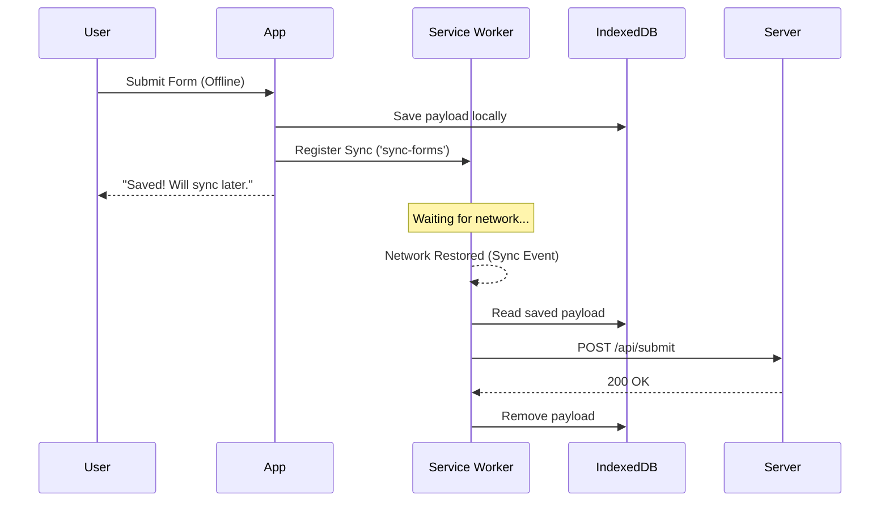

# Background Sync

**Background Sync** — это механизм, позволяющий веб-приложению откладывать выполнение действий (например, отправку данных) до тех пор, пока у пользователя не появится стабильное интернет-соединение.

Какую боль мы решаем? Представьте: пользователь заполняет длинную форму в поезде. Прямо перед отправкой поезд въезжает в туннель, связь обрывается. Если мы просто покажем ошибку «Нет сети», пользователь потеряет данные и разозлится. Background Sync позволяет нам сказать: «Всё ок, мы отправим это, как только появится сеть», и выполнить обещание даже если вкладка уже закрыта.



## Как это работает на практике

Механизм полагается на Service Worker'ы. Приложение регистрирует событие синхронизации с определенным тегом, а браузер берет на себя ответственность разбудить Service Worker и запустить событие `sync`, когда появится сеть.

```javascript
// Правильное решение: Регистрация синхронизации
navigator.serviceWorker.ready.then(registration => {
  return registration.sync.register('sync-messages');
});

// Обработка в Service Worker'е
self.addEventListener('sync', event => {
  if (event.tag === 'sync-messages') {
    event.waitUntil(syncOutboxMessages());
  }
});

async function syncOutboxMessages() {
  const messages = await getMessagesFromIndexedDB();
  for (const msg of messages) {
    await fetch('/api/messages', { method: 'POST', body: JSON.stringify(msg) });
    await deleteMessageFromIndexedDB(msg.id);
  }
}

// Антипаттерн: Хранение данных прямо в объекте события (так не работает)
// Данные нужно обязательно сохранять в IndexedDB перед регистрацией sync!
```

## Неочевидные нюансы и границы применимости
* **Поддержка браузерами:** Background Sync долгое время был эксклюзивом Chrome/Chromium. Safari (iOS) начал поддерживать его (через Background Fetch API) с большими оговорками. В iOS приложения могут быть убиты ОС, и фоновые задачи не гарантируют выполнения.
* **Двойная отправка (Idempotency):** Что если запрос ушел, но ответ не вернулся из-за обрыва связи? При следующем коннекте `sync` выполнится снова. Ваш бэкенд *обязан* поддерживать идемпотентность (например, передавать `uuid` запроса, чтобы не создать два одинаковых сообщения).
* **Ограничение времени:** Браузер дает Service Worker'у жесткий лимит времени (обычно несколько минут) на выполнение фоновой задачи. Если синхронизация занимает слишком много времени, она будет принудительно прервана.
