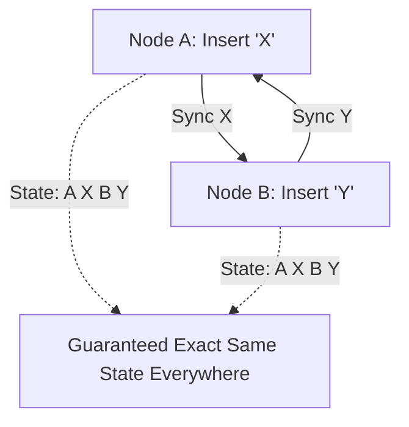

# Conflict-free Replicated Data Types (CRDT)

**CRDT** — это класс структур данных, которые могут обновляться независимо на разных узлах (клиентах), а затем объединяться обратно без конфликтов и без центрального координатора (сервера).

Какую боль мы решаем? Operational Transformation (OT), используемый в Google Docs, требует сложного центрального сервера, который выстраивает операции в строгую очередь. CRDT позволяет делать то же самое (коллаборативное редактирование, Figma, Notion), но P2P или с "тупым" сервером-релеем. Никаких конфликтов — математика гарантирует итоговую консистентность (Eventual Consistency).



## Как это работает на практике

CRDT работают за счет того, что все операции коммутативны (порядок применения не важен: $A + B = B + A$) и идемпотентны (двойное применение не ломает результат).

Существует два типа CRDT:
1. **State-based (CvRDT):** Узлы обмениваются всем состоянием (или дельтами) и объединяют их функцией merge (например, находя максимум).
2. **Operation-based (CmRDT):** Узлы обмениваются конкретными операциями (insert, delete).

Пример (псевдо-CRDT счетчик, G-Counter):
```javascript
// Правильный подход: массив счетчиков по количеству клиентов
class GCounter {
  constructor(nodeId) {
    this.nodeId = nodeId;
    this.state = {};
  }
  
  increment() {
    this.state[this.nodeId] = (this.state[this.nodeId] || 0) + 1;
  }
  
  // Коммутативная функция слияния
  merge(otherCounterState) {
    for (const key in otherCounterState) {
      this.state[key] = Math.max(this.state[key] || 0, otherCounterState[key]);
    }
  }
  
  get value() {
    return Object.values(this.state).reduce((a, b) => a + b, 0);
  }
}
```

## Неочевидные нюансы и границы применимости
* **Разрастание памяти (Tombstones):** Чтобы CRDT работал, он должен помнить, *что* было удалено (tombstones). Из-за этого размер документа со временем только растет, даже если вы удалили весь текст. Периодически требуется процесс "сборки мусора" (Garbage Collection), который в децентрализованной системе сделать очень сложно.
* **Intention Preservation:** CRDT гарантирует, что у всех будет одинаковый результат, но не гарантирует, что он будет *осмысленным*. Если один пользователь сделал слово жирным, а другой удалил его, CRDT объединит это без ошибок, но результат (жирное "ничего" или просто удаленное слово) может разойтись с исходным намерением пользователей.
* **Использование библиотек:** Никогда не пишите CRDT с нуля в продакшене. Используйте проверенные библиотеки: `Yjs` (очень популярна в веб-экосистеме) или `Automerge`.
