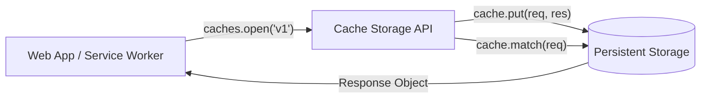

# Cache Storage API

**Cache Storage** — это механизм хранения пар «Request - Response», созданный специально для Service Worker'ов и обеспечения работы веб-приложений в офлайне (или ускорения загрузки). 

Какую боль мы решаем? До Cache API у нас был AppCache (ныне мертвый), который был декларативным, негибким и часто ломался. HTTP-кэширование хорошо для браузера, но им нельзя управлять программно. Cache Storage дает разработчикам полный контроль над тем, *что* кэшировать, *когда* отдавать из кэша и *как* очищать устаревшие данные.



## Как это работает

Cache API работает с нативными объектами `Request` и `Response` (из Fetch API). Вы можете перехватить запрос в Service Worker'е, поискать ответ в кэше и отдать его, даже не стучась в сеть.

```javascript
// Правильный паттерн: Cache, falling back to network
self.addEventListener('fetch', event => {
  event.respondWith(
    caches.match(event.request).then(cachedResponse => {
      // Вернуть из кэша, если есть
      if (cachedResponse) {
        return cachedResponse;
      }
      // Иначе идем в сеть, клонируем ответ и кэшируем на будущее
      return fetch(event.request).then(networkResponse => {
        return caches.open('dynamic-cache-v1').then(cache => {
          cache.put(event.request, networkResponse.clone());
          return networkResponse;
        });
      });
    })
  );
});

// Антипаттерн: Попытка кэшировать POST запросы
// Cache API не поддерживает метод POST. Вы получите ошибку TypeError.
caches.put(new Request('/api/data', { method: 'POST' }), response); 
```

## Неочевидные нюансы
* **Opaque Responses (Непрозрачные ответы):** Если вы делаете запрос `no-cors` к стороннему домену (например, запрашиваете картинку), возвращается Opaque Response. Его статус всегда `0`. Вы можете закэшировать его, но он будет занимать непропорционально много места (браузеры искусственно раздувают размер таких кэшей до 7+ МБ для защиты от cross-origin атак типа padding).
* **Потребление памяти:** Ответы (особенно видео или большие изображения) в Cache API могут быстро съесть квоту пользователя. Необходимо реализовывать логику вытеснения (LRU - Least Recently Used) при достижении лимита.
* **Не только Service Worker:** К Cache API можно обращаться и из основного потока (из `window`). Это полезно для предварительной загрузки (prefetching) ресурсов прямо из UI-компонентов до того, как пользователь кликнет по ссылке.
