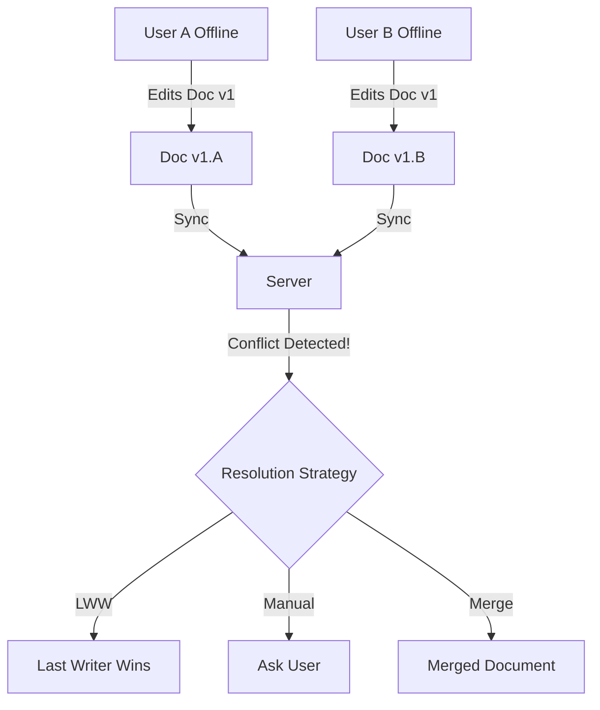

# Conflict Resolution (Разрешение конфликтов)

**Разрешение конфликтов** — это краеугольный камень любой распределенной системы, к коим относится и офлайн-first веб-приложение. 

Какую боль мы решаем? Представьте, что два пользователя редактируют один и тот же документ в Google Docs, сидя в самолетах без интернета. Когда оба приземлятся и подключатся к сети, чьи изменения станут правдой? Если просто применить «кто последний, тот и прав», один из пользователей потеряет свою работу. Разрешение конфликтов — это набор стратегий, решающих эту проблему мирным или автоматическим путем.



## Стратегии разрешения конфликтов

Существует несколько подходов, каждый со своими трейдоффами:

1. **Last Write Wins (LWW).** Сервер просто берет тот timestamp, который больше. 
   - *Плюсы:* Легко реализовать.
   - *Минусы:* Данные теряются. Не подходит для коллаборативного редактирования.
2. **Ручное разрешение.** Сервер отклоняет коммит (возвращает 409 Conflict) и просит клиента разобраться (как `git merge`).
   - *Плюсы:* Данные никогда не теряются без ведома пользователя.
   - *Минусы:* Ухудшает UX. Пользователю приходится разбираться в "diff".
3. **CRDT / Operational Transformation.** Автоматическое математически выверенное слияние (подробнее в отдельной статье).

## Пример: Оптимистичная блокировка с ревизиями (Version Vectors)

```javascript
// Правильный подход: Передаем версию, которую мы редактировали
async function saveDocument(doc) {
  const response = await fetch('/api/docs/1', {
    method: 'PUT',
    body: JSON.stringify(doc),
    headers: { 'If-Match': `"${doc.version}"` } // ETag / Version
  });

  if (response.status === 412) {
    // Precondition Failed - произошел конфликт
    const latestDoc = await (await fetch('/api/docs/1')).json();
    return promptUserToMerge(doc, latestDoc);
  }
  return response.json();
}
```

## Неочевидные нюансы
* **Часы рассинхронизированы (Clock Drift):** Никогда не доверяйте времени клиента (`Date.now()`) при разрешении конфликтов LWW. У пользователя может быть сбит часовой пояс или сломаны часы. Всегда используйте векторные часы (Vector Clocks) или логическое время сервера.
* **Каскадные конфликты:** Если один конфликт влечет за собой нарушение консистентности в связанных сущностях (например, удалена категория, а пользователь в офлайне добавил туда товар), бэкенд должен уметь откатывать (rollback) целые цепочки транзакций.
