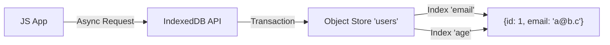

# IndexedDB

**IndexedDB** — это низкоуровневая, асинхронная NoSQL база данных прямо в браузере. Это самое мощное и вместительное хранилище для клиентского веб-приложения.

Какую боль мы решаем? `localStorage` синхронен (блокирует основной поток), ограничен 5 мегабайтами и хранит только строки. Cache Storage подходит только для `Request`/`Response`. Если вам нужно сохранить 50 000 JSON-объектов (например, каталог товаров), быстро по ним искать с помощью индексов и не повесить вкладку, единственный выбор — IndexedDB.



## Как это работает на практике

IndexedDB работает через паттерн событий, что делает её нативный API крайне многословным и неудобным. Вся работа происходит внутри транзакций.

```javascript
// Антипаттерн: Использование нативного API в 2024 году (callback hell)
const request = indexedDB.open('my-db', 1);
request.onsuccess = event => {
  const db = event.target.result;
  const tx = db.transaction('store', 'readwrite');
  // ... еще 10 строк бойлерплейта
};

// Правильный подход: Использование оберток-промисов (например, idb от Jake Archibald)
import { openDB } from 'idb';

async function saveUser(user) {
  const db = await openDB('my-db', 1, {
    upgrade(db) {
      if (!db.objectStoreNames.contains('users')) {
        const store = db.createObjectStore('users', { keyPath: 'id' });
        store.createIndex('by-email', 'email', { unique: true });
      }
    },
  });

  // Автоматически запускает транзакцию
  await db.put('users', user);
}
```

## Неочевидные нюансы
* **Safari Bugs:** В старых версиях Safari IndexedDB работала отвратительно (тихие падения, потеря данных). Сейчас ситуация лучше, но баги с квотами и очисткой в ITP (Intelligent Tracking Prevention) все еще встречаются (очистка базы через 7 дней неактивности).
* **Сложность миграций:** Если вы меняете структуру базы (добавляете индекс), вам нужно инкрементировать версию БД. Логика в обработчике `upgradeneeded` может стать очень запутанной, если вам нужно поддерживать миграции с версии 1 на 10 и с 9 на 10.
* **Транзакции авто-закрываются:** Вы не можете сделать `await fetch(...)` внутри транзакции IndexedDB. Как только цикл событий (event loop) браузера прокручивается без активности в транзакции, она автоматически фиксируется (коммитится) и закрывается. Все асинхронные операции должны происходить *до* открытия транзакции или *после*.
