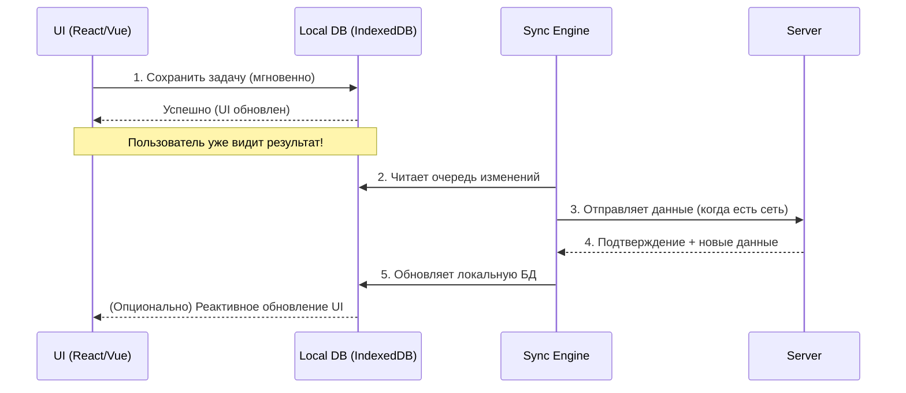

# Offline First Архитектура

Подход **Offline First** означает, что отсутствие интернета для приложения — это не ошибка, а нормальное, ожидаемое состояние. Приложение изначально проектируется так, чтобы читать и писать данные в локальную базу (на клиенте), а уже затем, в фоновом режиме, синхронизировать их с сервером.

## Какую боль мы решаем?
Мы решаем проблему «рваного» соединения (flaky network). Когда пользователь едет в метро, заходит в лифт или просто сталкивается с медленным 3G, обычные веб-приложения показывают бесконечные лоадеры или падают с ошибкой `Network Error`. Offline First дает мгновенный отклик: пользователь кликает — UI обновляется сразу.

## Как это работает
Вместо того чтобы делать прямой HTTP-запрос на сервер, UI обращается к локальной базе данных (обычно IndexedDB). Фоновый процесс (Sync Engine или Service Worker) следит за сетью и отправляет накопленные локальные изменения на бэкенд, когда появляется связь.



## Примеры кода

### Антипаттерн: Ждем сервер перед обновлением UI
```typescript
async function createPost(text: string) {
  setLoading(true);
  try {
    // Ждем медленную сеть. Если упадет — пользователь потеряет введенный текст.
    const newPost = await api.post('/posts', { text });
    setPosts([...posts, newPost]);
  } catch (e) {
    showError("Нет сети");
  } finally {
    setLoading(false);
  }
}
```

### Как надо: Optimistic UI + Локальная очередь
```typescript
async function createPostOfflineFirst(text: string) {
  const tempId = generateUUID();
  const post = { id: tempId, text, status: 'syncing' };
  
  // 1. Мгновенно показываем в UI
  setPosts([...posts, post]);
  
  // 2. Пишем в локальную БД и ставим в очередь на отправку
  await localDb.posts.put(post);
  await localDb.syncQueue.put({ action: 'CREATE', payload: post });
  
  // 3. Пингуем воркер для начала синхронизации
  triggerBackgroundSync();
}
```

## Неочевидные нюансы и трейдоффы

* **Разрешение конфликтов (Conflict Resolution):** Если два пользователя отредактировали один и тот же документ офлайн, чей вариант победит при синхронизации? Вам придется внедрять сложные концепции: Last-Write-Wins (LWW), версионирование или CRDT (Conflict-free Replicated Data Types).
* **Миграции локальной БД:** Если вы обновили схему данных на бэкенде, вам нужно написать миграции для IndexedDB у всех клиентов. Если миграция упадет, приложение сломается безвозвратно.
* **Overhead на размер состояния:** Приложение должно хранить весь необходимый контекст пользователя локально. Это может раздуть кэш до сотен мегабайт.

**Когда использовать:** Инструменты продуктивности (Linear, Notion, Trello), почтовые клиенты, приложения для складских работников (где Wi-Fi часто не ловит).
**Когда ломается/не нужно:** Новостные порталы, интернет-магазины (оформлять заказ офлайн нет смысла, цены и сток постоянно меняются).
