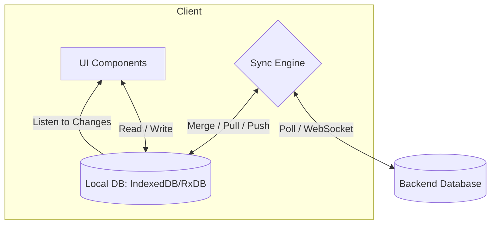

# Offline First Architecture

**Offline First** — это смена парадигмы проектирования. Вместо того чтобы считать сеть надежным ресурсом и показывать ошибку при ее отсутствии, мы строим приложение так, будто интернета нет по умолчанию, а сеть — это лишь дополнительное улучшение (Progressive Enhancement) для синхронизации данных.

Какую боль мы решаем? Традиционные приложения (Network First) ломаются при малейшем чихе сети (Lie-Fi: Wi-Fi подключен, но пакеты не идут). Пользователь сидит и смотрит на бесконечный спиннер. Offline First гарантирует немедленный ответ интерфейса: данные пишутся локально и читаются локально, обеспечивая мгновенный UX.



## Как это работает на практике

Архитектура состоит из 3 слоев:
1. **Локальное хранилище (Source of Truth для UI):** UI никогда не ждет ответа от сервера. Он подписывается на изменения в локальной БД (например, IndexedDB).
2. **Очередь мутаций (Sync Queue):** Когда пользователь нажимает "Сохранить", действие (интент) записывается в локальную очередь.
3. **Синхронизатор (Background Worker):** Отдельный процесс (или Service Worker), который берет события из очереди, шлет их на сервер, получает ответы и обновляет локальную БД.

```javascript
// Правильный паттерн (Оптимистичный UI):
async function addTodo(text) {
  const tempId = generateUuid();
  const todo = { id: tempId, text, synced: false };
  
  // 1. Сохраняем локально (UI сразу обновляется через реактивность)
  await localDB.todos.put(todo);
  
  // 2. Отправляем задачу в очередь синхронизации
  await syncQueue.push({ action: 'CREATE_TODO', payload: todo });
  
  // 3. Пингуем Sync Engine (если в сети)
  triggerSync();
}
```

## Неочевидные нюансы
* **Сложность стейт-менеджмента:** Разработка усложняется в разы. Вы должны держать в уме 3 состояния сущности: *локальное*, *в процессе синхронизации* и *подтвержденное сервером*.
* **Генерация ID:** В Offline First клиенты не могут ждать автоинкрементного ID от базы PostgreSQL. Клиент сам генерирует идентификаторы. Используйте UUIDv4, UUIDv7 или ULID/CUID, чтобы избежать коллизий при синхронизации.
* **Тяжелый первый старт (Cold Start):** При первом открытии приложения, если вы хотите полный офлайн, вам нужно выкачать с сервера огромный дамп данных пользователя, что может занять много времени и трафика. Это требует умной стратегии частичной синхронизации (Sync by Demand).
