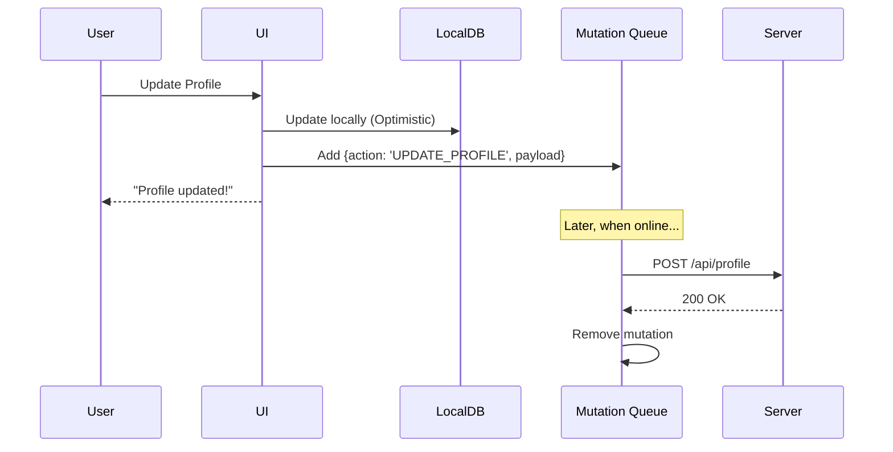

# Offline Mutations (Офлайн-мутации)

**Офлайн-мутации** — это паттерн обработки пользовательских действий (создание, обновление, удаление данных), когда клиент находится без связи с сервером.

Какую боль мы решаем? В классическом приложении кнопка "Сохранить" блокируется или крутит бесконечный лоадер, если нет интернета. Это рушит флоу пользователя. Офлайн-мутации позволяют пользователю изменять данные так, будто сервер ответил `200 OK` мгновенно, складывая намерения (intents) в очередь для отложенной отправки.



## Как это работает на практике

Процесс тесно связан с Оптимистичным UI (Optimistic UI).

1. Пользователь совершает действие.
2. Приложение синхронно обновляет локальное состояние (Redux, Zustand, Apollo Cache, IndexedDB).
3. Создается объект мутации, описывающий запрос к серверу, и помещается в персистентную очередь (Sync Queue).
4. Как только появляется сеть, фоновый процесс выгребает очередь и отправляет запросы.

```javascript
// Пример с использованием React Query (Оптимистичные мутации)
const queryClient = useQueryClient();

const mutation = useMutation({
  mutationFn: updateTodoOnServer,
  // Вызывается перед отправкой запроса
  onMutate: async newTodo => {
    await queryClient.cancelQueries({ queryKey: ['todos'] });
    const previousTodos = queryClient.getQueryData(['todos']);
    
    // Оптимистично обновляем кэш
    queryClient.setQueryData(['todos'], old => [...old, newTodo]);
    
    // Возвращаем контекст для отката в случае ошибки
    return { previousTodos };
  },
  // Если сервер вернул 500
  onError: (err, newTodo, context) => {
    queryClient.setQueryData(['todos'], context.previousTodos);
    showToast("Не удалось сохранить на сервере. Откат изменений.");
  }
});
```

## Неочевидные нюансы
* **Зависимые мутации:** Что если пользователь создал Папку (получил временный `id=temp_1`) и сразу создал в ней Заметку (`folderId=temp_1`)? Серверу нужны реальные ID из БД. Очередь мутаций должна уметь резолвить (подменять) временные ID на реальные по мере последовательного выполнения запросов.
* **Идемпотентность:** Если ответ от сервера потерялся по пути к клиенту, очередь может отправить мутацию повторно. Сервер должен понимать, что это дубль (через токены идемпотентности или Request-ID), иначе деньги могут быть списаны дважды.
* **Конфликты UX:** Если во время офлайна другой пользователь удалил карточку, которую вы пытаетесь обновить, после появления сети ваша мутация упадет с 404. Пользователю придется показать сложное модальное окно с разрешением конфликта.
