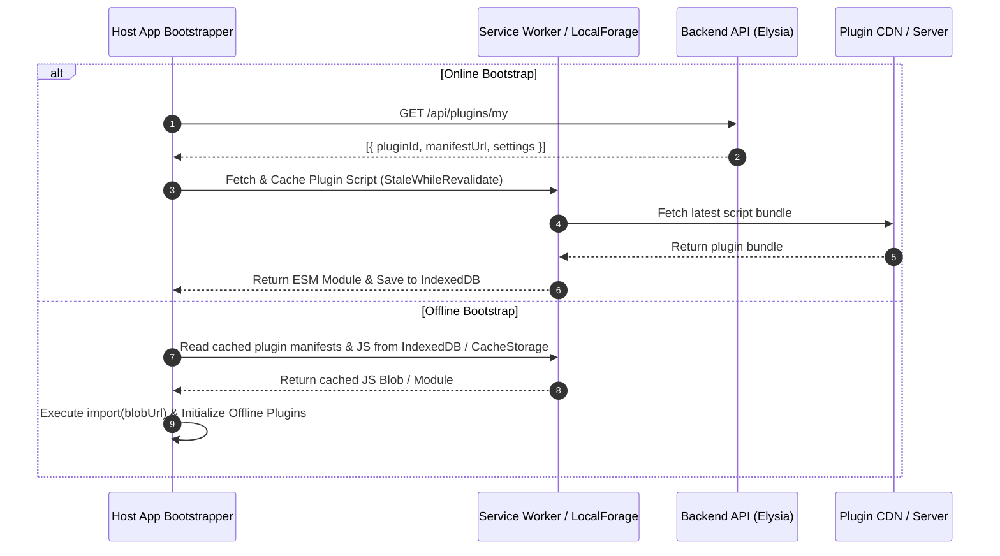

# Синхронизация и оффлайн-кэширование плагинов (Plugin Offline Persistence)

В Offline-First приложениях (PWA / Tauri) архитектура динамических плагинов должна поддерживать работоспособность даже при полном отсутствии подключения к сети. Пользователь, установивший плагин на одном устройстве, должен увидеть его на всех остальных устройствах после синхронизации, а при переходах в оффлайн-режим интерфейс плагина должен загружаться мгновенно из локального хранилища.

Данный подход объединяет серверную синхронизацию списка установленных плагинов с клиентской стратегией кэширования их JS-бандлов.



## 1. Серверный слой синхронизации (Backend Schema)

Привязка плагинов к пользовательскому аккаунту реализуется отдельной таблицей метаданных плагинов пользователей.

```typescript
// db/schema.ts (Elysia + Drizzle ORM + SQLite)
import { sqliteTable, text, integer, primaryKey } from 'drizzle-orm/sqlite-core';
import { users } from './users';

export const userPlugins = sqliteTable('user_plugins', {
  userId: integer('user_id').notNull().references(() => users.id),
  pluginId: text('plugin_id').notNull(),
  manifestUrl: text('manifest_url').notNull(), // URL до манифеста/JS бандла
  settings: text('settings'), // JSON-строка индивидуальных настроек
  isEnabled: integer('is_enabled', { mode: 'boolean' }).default(true),
}, t => [primaryKey({ columns: [t.userId, t.pluginId] })]);
```

## 2. Кэширование JS-бандлов в оффлайне (Service Worker vs IndexedDB Blob)

Для сохранения динамических скриптов в оффлайн-клиенте используются два подхода:

### Стратегия A: Service Worker (Workbox `StaleWhileRevalidate`)

Если плагины загружаются по стандартным HTTP URL, Service Worker автоматически перехватывает эти запросы:

```typescript
// service-worker.ts (Workbox Strategy)
import { registerRoute } from 'workbox-routing';
import { StaleWhileRevalidate } from 'workbox-strategies';
import { ExpirationPlugin } from 'workbox-expiration';

registerRoute(
  ({ url }) => url.pathname.endsWith('.plugin.js') || url.hostname === 'cdn.site',
  new StaleWhileRevalidate({
    cacheName: 'dynamic-plugins-cache',
    plugins: [
      new ExpirationPlugin({ maxEntries: 50, maxAgeSeconds: 30 * 24 * 60 * 60 }),
    ],
  })
);
```

### Стратегия B: Сохранение исходного кода в IndexedDB (LocalForage + Blob URL)

Для десктопных приложений на Tauri или браузеров с жесткими ограничениями Service Worker код бандла сохраняется прямо в IndexedDB как строка или Blob:

```typescript
// plugin-offline-loader.ts
import localforage from 'localforage';

export async function loadPluginWithOfflineFallback(manifestUrl: string): Promise<any> {
  const cacheKey = `plugin_code_${manifestUrl}`;
  
  if (navigator.onLine) {
    try {
      const response = await fetch(manifestUrl);
      const code = await response.text();
      // Сохраняем свежий код плагина в IndexedDB
      await localforage.setItem(cacheKey, code);
      return await importCodeAsBlob(code);
    } catch (e) {
      console.warn('[PluginLoader] Не удалось загрузить свежий плагин, переход на оффлайн кэш', e);
    }
  }

  // Оффлайн фоллбэк из IndexedDB
  const cachedCode = await localforage.getItem<string>(cacheKey);
  if (!cachedCode) {
    throw new Error(`[PluginLoader] Плагин ${manifestUrl} недоступен в оффлайн-кэше.`);
  }

  return await importCodeAsBlob(cachedCode);
}

// Преобразование кода в Blob URL для нативного import()
async function importCodeAsBlob(code: string) {
  const blob = new Blob([code], { type: 'application/javascript' });
  const blobUrl = URL.createObjectURL(blob);
  try {
    return await import(/* @vite-ignore */ blobUrl);
  } finally {
    URL.revokeObjectURL(blobUrl);
  }
}
```

## Неочевидные нюансы и границы применимости

1. **Утечки Blob URL:** При вызове `URL.createObjectURL` необходимо вовремя освобождать память через `URL.revokeObjectURL(blobUrl)`. Однако освобождать URL можно только после завершения всех динамических импортов в графе зависимостей модуля.
2. **Конфликты синхронизации настроек плагинов:** Если пользователь меняет настройки плагина на двух устройствах в оффлайне, при подсоединении к сети таблицы `user_plugins.settings` требуют стратегию разрешения конфликтов (например, Last-Write-Wins по timestamp или CRDT).
3. **Очистка устаревшего кэша:** При удалении плагина из аккаунта хост-приложение должно не просто отключить его в UI, но и явно удалить запись JS-бандла из IndexedDB / CacheStorage, чтобы освободить дисковое пространство.
