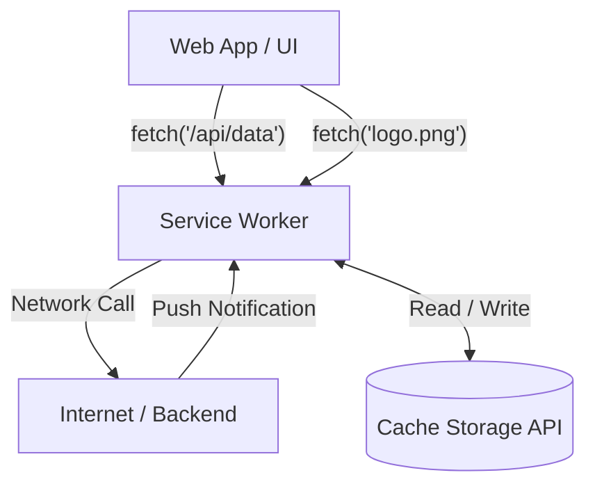

# Service Workers (Сервис-воркеры)

**Service Worker** — это скрипт, который браузер запускает в фоновом режиме, отдельно от веб-страницы. Это сердце любой архитектуры PWA (Progressive Web App) и Offline First.

Какую боль мы решаем? Веб-страницы эфемерны: закрыл вкладку — приложение умерло. Service Worker живет своей жизнью. Он стоит как прокси-сервер между вашим приложением и сетью, позволяя перехватывать запросы, кэшировать их, получать Push-уведомления и выполнять фоновую синхронизацию, даже когда сайт закрыт.



## Как это работает на практике

Service Worker имеет свой жизненный цикл (Lifecycle), независимый от вкладки:
1. **Download:** Браузер скачивает файл воркера.
2. **Install:** Вызывается один раз. Здесь мы обычно кэшируем статику (App Shell).
3. **Activate:** Вызывается при обновлении воркера. Здесь мы чистим старые кэши.
4. **Fetch / Message / Push:** Воркер работает и слушает события.

```javascript
// Регистрация в main.js
if ('serviceWorker' in navigator) {
  navigator.serviceWorker.register('/sw.js').then(reg => {
    console.log('SW Registered!', reg.scope);
  });
}

// В самом файле sw.js (Перехват запросов)
self.addEventListener('fetch', event => {
  event.respondWith(
    caches.match(event.request).then(cachedResponse => {
      // Возвращаем из кэша, или идем в сеть
      return cachedResponse || fetch(event.request);
    })
  );
});
```

## Неочевидные нюансы
* **Только HTTPS:** Service Worker обладает огромной властью (может переписать любой ответ). Поэтому он работает *только* по протоколу HTTPS (или на `localhost` для разработки).
* **Scope (Область видимости):** Воркер может контролировать только те страницы, которые находятся в его директории или глубже. Если `sw.js` лежит в `/js/sw.js`, он не сможет перехватывать запросы для `/index.html`. Кладите `sw.js` в корень проекта.
* **Проблема обновления (The Update Nightmare):** По умолчанию, если вы выкатили новую версию `sw.js`, браузер скачает ее, но *не активирует*, пока пользователь не закроет *все* вкладки с вашим сайтом (чтобы не сломать работу текущих вкладок). Это приводит к тому, что пользователи видят старую версию сайта днями. Решается отправкой сообщения `skipWaiting` из UI при нажатии на кнопку "Обновить".
