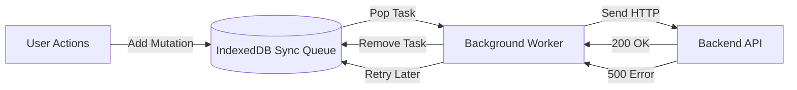

# Sync Queue (Очередь синхронизации)

**Sync Queue** — это структура данных, используемая в офлайн-приложениях для надежного хранения локальных изменений пользователя до тех пор, пока они не будут успешно доставлены на сервер.

Какую боль мы решаем? Если пользователь нажимает "Лайк" без интернета, мы не можем просто держать этот HTTP-запрос в оперативной памяти (в Promise). Вкладка может быть закрыта, браузер убит операционной системой. Нам нужно персистентное (выживающее после перезагрузки) хранилище намерений.



## Как это работает на практике

Очередь обычно реализуется поверх IndexedDB. Каждая запись (job) содержит всю необходимую информацию для воспроизведения запроса: endpoint, метод, headers, body и timestamp.

```javascript
// Правильный подход: Сохранение метаданных запроса
const syncStore = idb.transaction('sync-queue', 'readwrite').objectStore('sync-queue');

// Добавление в очередь
await syncStore.add({
  id: Date.now(), // Сортировка по времени
  url: '/api/comments',
  method: 'POST',
  body: { text: "Отличное фото!" },
  retries: 0
});

// Процесс выгребания (вызывается при 'online' или Background Sync)
async function processQueue() {
  const jobs = await syncStore.getAll();
  for (const job of jobs) {
    try {
      await fetch(job.url, { method: job.method, body: JSON.stringify(job.body) });
      await syncStore.delete(job.id); // Успех - удаляем
    } catch (err) {
      if (isNetworkError(err)) break; // Нет сети - останавливаем очередь
      // Если 4xx ошибка (Bad Request) - помечаем как failed и убираем из очереди
    }
  }
}
```

## Неочевидные нюансы
* **Порядок выполнения (FIFO):** Очередь обязана быть строго упорядоченной (First In, First Out). Если пользователь переименовал папку, а затем удалил её, запросы должны прийти на сервер именно в таком порядке. Если параллелить отправку, сервер может попытаться удалить папку до ее переименования (получив 404 на втором запросе).
* **Схлопывание мутаций (Debouncing / Compaction):** Если пользователь 10 раз поменял заголовок статьи в офлайне, очередь может раздуться до 10 запросов `PUT /article`. Умная Sync Queue перед отправкой "схлопнет" их в один финальный запрос, сэкономив трафик.
* **Dead Letter Queue (Кладбище запросов):** Что делать, если запрос постоянно падает с 500 ошибкой? Если не ограничить число попыток (retries), очередь застопорится на одном сломанном запросе (Head-of-line blocking). После N попыток запрос нужно перемещать в отдельную таблицу "ошибок" и просить пользователя вмешаться вручную.
