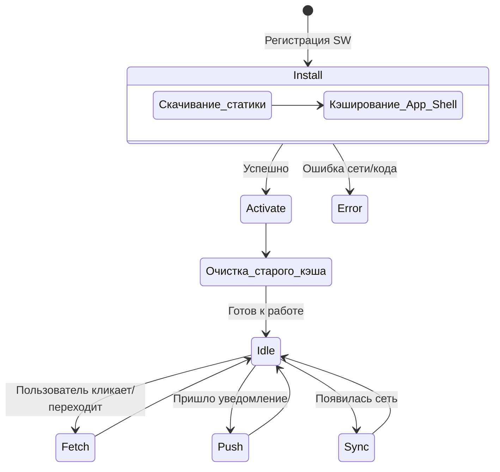

# Progressive Web Apps (PWA) и Мобильный Web

PWA — это набор технологий (Service Workers, Web App Manifest, Push API), которые позволяют обычному сайту вести себя и ощущаться как нативное мобильное приложение. 

## Какую боль мы решаем?
Разработка нативных приложений под iOS и Android — это дорого, требует двух разных команд (Swift и Kotlin), а публикация в App Store/Google Play сопровождается долгими ревью и комиссиями в 30%. PWA позволяет одной команде веб-разработчиков создать продукт, который устанавливается на телефон прямо из браузера в обход сторов.

## Как это работает на практике

Ядром PWA является **Service Worker** — скрипт, работающий в фоновом потоке отдельно от веб-страницы. Он может перехватывать запросы, кэшировать ресурсы и принимать Push-уведомления даже когда вкладка браузера закрыта.



## Примеры кода

### Минимальный Web App Manifest (`manifest.json`)
Этот файл говорит браузеру, что сайт можно "установить" на главный экран телефона, задает иконки и скрывает UI браузера (адресную строку).
```json
{
  "name": "Моя Крутая Таска",
  "short_name": "TaskApp",
  "start_url": "/",
  "display": "standalone",
  "background_color": "#ffffff",
  "theme_color": "#1e88e5",
  "icons": [
    {
      "src": "/icon-192x192.png",
      "sizes": "192x192",
      "type": "image/png"
    }
  ]
}
```

### Антипаттерн: Агрессивный Prompt установки
```javascript
// Плохо: показывать баннер "Установи наше приложение!" 
// в первую секунду визита пользователя.
window.addEventListener('beforeinstallprompt', (e) => {
  e.prompt(); // Раздражает пользователя, высокий процент отказов
});
```

### Как надо: Контекстный вызов установки
```javascript
let deferredPrompt;

window.addEventListener('beforeinstallprompt', (e) => {
  e.preventDefault();
  deferredPrompt = e;
  // Показываем кастомную ненавязчивую кнопку установки где-то в меню
  showInstallButton();
});

installButton.addEventListener('click', async () => {
  deferredPrompt.prompt();
  const { outcome } = await deferredPrompt.userChoice;
  if (outcome === 'accepted') {
    console.log('Пользователь установил PWA');
  }
});
```

## Неочевидные нюансы (Apple vs Web)

Сфера PWA — это поле битвы между Google, который активно пушит веб, и Apple, которая защищает доходы App Store.
* **Push-уведомления на iOS:** Исторически были недоступны, но появились в iOS 16.4+. Однако работают *только* если пользователь добавил PWA на домашний экран (Add to Home Screen).
* **Срок жизни кэша:** В Safari (iOS) если пользователь не открывает PWA несколько недель, браузер может молча удалить все данные из LocalStorage и IndexedDB для экономии места.
* **Background Sync:** В Chrome на Android Service Worker может доотправить данные на сервер, даже если браузер закрыт. В iOS фоновые процессы сильно ограничены.

**Где применять:** B2B инструменты, корпоративные порталы, MVP стартапов, медиа-сайты.
**Где не стоит:** Приложения, требующие прямого доступа к низкоуровневому железу (Bluetooth, сложные вычисления GPU) или если ваш бизнес критично зависит от органического трафика из App Store.
