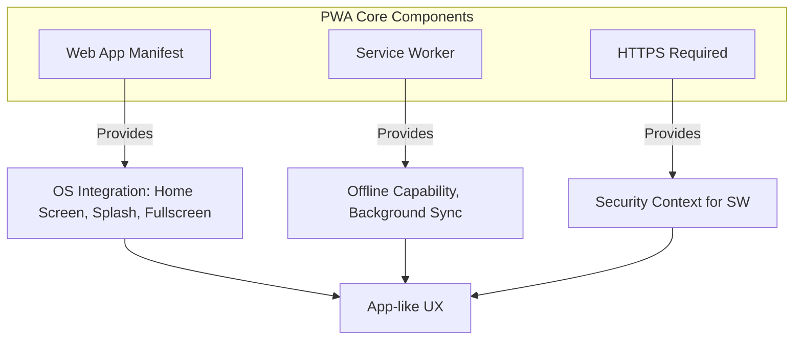

# PWA Architecture (Архитектура PWA)

**PWA (Progressive Web App)** — это набор технологий, превращающих обычный веб-сайт в приложение, которое выглядит и ведет себя как нативное на мобильном устройстве (иконка на рабочем столе, работа без сети, пуши).

Какую боль мы решаем? Разработка нативных приложений под iOS и Android — это дорого, долго и требует прохождения модерации в сторах (Apple App Store, Google Play). PWA позволяет написать код один раз на веб-технологиях (HTML/JS/CSS) и дать пользователю "установить" сайт прямо из браузера, минуя магазины.



## Как это работает на практике

Архитектура строится вокруг трех обязательных столпов:
1. **App Manifest (`manifest.json`):** JSON-файл, описывающий метаданные (название, иконки, цвета темы, стартовый URL и режим отображения, например `standalone`, убирающий UI браузера).
2. **Service Worker:** Скрипт-посредник для кэширования статики и данных (App Shell Architecture).
3. **HTTPS:** Обязательное условие для работы Service Worker.

```json
// Правильный manifest.json
{
  "name": "My Super PWA",
  "short_name": "SuperPWA",
  "start_url": "/?source=pwa",
  "display": "standalone",
  "background_color": "#ffffff",
  "theme_color": "#000000",
  "icons": [
    {
      "src": "/icon-192.png",
      "sizes": "192x192",
      "type": "image/png"
    },
    {
      "src": "/icon-512.png",
      "sizes": "512x512",
      "type": "image/png"
    }
  ]
}
```

## Неочевидные нюансы
* **iOS — это боль:** Apple исторически саботирует PWA, чтобы защитить доходы от App Store. На iOS PWA не могут использовать Web Push (появились только в iOS 16.4), у них урезан объем хранилища (50MB), они очищаются при неактивности, а также не поддерживают многие фичи (например, Web Bluetooth, Background Sync).
* **Сложность обновления:** В нативном приложении пользователь качает обновление из стора. В PWA вам нужно самому писать логику, которая покажет баннер "Доступна новая версия, перезагрузить?", иначе Service Worker будет вечно отдавать старый кэш.
* **Маскировка под натив (App Shell):** Чтобы PWA чувствовалось как приложение, вы должны мгновенно (из кэша) рендерить "скелет" (App Shell: хедер, меню, лоадер), пока данные догружаются. Никаких белых экранов!
