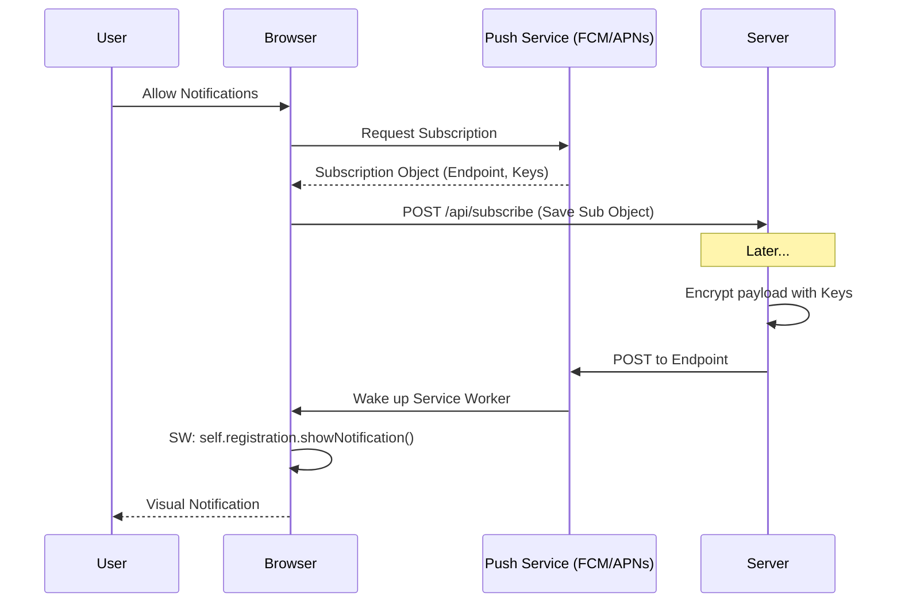

# Web Push Notifications

**Web Push** — это технология доставки уведомлений пользователю от сервера, даже если вкладка с приложением закрыта.

Какую боль мы решаем? Долгое время веб-приложения не могли напомнить о себе. Если пользователь закрыл вкладку мессенджера, он пропустит важное сообщение. Web Push возвращает пользователей в приложение (re-engagement), уравнивая веб с нативными мобильными приложениями.



## Как это работает на практике

Процесс состоит из двух частей: Подписка (на клиенте) и Отправка (на сервере). Браузер сам общается со своим Push-сервисом (у Chrome это FCM, у Firefox — Mozilla Push Service, у Safari — APNs). Серверу нужно лишь знать уникальный `endpoint` и ключи шифрования.

```javascript
// Правильный подход: Подписка пользователя с использованием VAPID ключа
async function subscribeUser() {
  const swRegistration = await navigator.serviceWorker.ready;
  const subscription = await swRegistration.pushManager.subscribe({
    userVisibleOnly: true, // Обязательно в Chrome (запрет тихих пушей)
    applicationServerKey: urlB64ToUint8Array('ВАШ_ПУБЛИЧНЫЙ_VAPID_КЛЮЧ')
  });
  
  // Отправляем объект подписки на наш бэкенд
  await fetch('/api/save-subscription', {
    method: 'POST',
    body: JSON.stringify(subscription)
  });
}

// Service Worker (sw.js): Отображение пуша
self.addEventListener('push', event => {
  const data = event.data.json();
  const options = {
    body: data.body,
    icon: '/icon.png',
    badge: '/badge.png'
  };
  event.waitUntil(self.registration.showNotification(data.title, options));
});
```

## Неочевидные нюансы
* **VAPID (Voluntary Application Server Identification):** Это спецификация, которая позволяет Push-сервисам (Google/Apple) знать, *кто* отправляет уведомления. Без настройки VAPID-ключей на бэкенде современные пуши не работают.
* **Устаревание подписок:** Endpoint'ы живут не вечно. Пользователь может отозвать права, или браузер сменит токен. Сервер при отправке пуша должен обрабатывать 410 Gone ошибку от Push Service и удалять мертвую подписку из БД.
* **Разрешение в плохой момент (Prompt Spam):** Никогда не запрашивайте разрешение на пуши (prompt) при первой загрузке страницы — конверсия будет 1-2%, и браузер может заблокировать вас навсегда. Просите права *только* после осмысленного действия (например, пользователь нажал "Уведомить о скидке").
