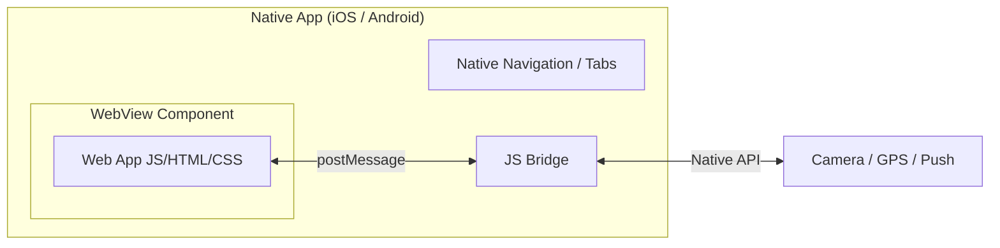

# Разделение Web и WebView

**WebView** — это встраиваемый компонент (мини-браузер без адресной строки), позволяющий рендерить веб-контент внутри нативного мобильного приложения (iOS/Android).

Какую боль мы решаем? Часто бизнес хочет одно приложение и для веба, и для мобилок. Делать PWA не всегда вариант из-за ограничений iOS или нужды быть в сторах. Писать натив с нуля — дорого. Решение: обернуть веб-приложение (или его часть) в нативную "скорлупу" (Capacitor, React Native WebView, Cordova). 



## Как это работает на практике

Главная архитектурная задача — наладить общение между "вебом" и "нативом". Это делается через **JS Bridge**. Нативный код инжектит глобальные функции в `window`, а веб вызывает их, или они общаются через события `postMessage`.

```javascript
// Правильный подход: Абстракция слоя платформы (Platform Interface)
class PlatformBridge {
  static async takePhoto() {
    // Если мы внутри iOS/Android WebView (определяем по User-Agent или инжектнутому объекту)
    if (window.ReactNativeWebView) {
      return new Promise(resolve => {
        const requestId = Date.now();
        // Подписываемся на ответ от натива
        window.addEventListener('message', function handler(e) {
          if (e.data.id === requestId) {
            window.removeEventListener('message', handler);
            resolve(e.data.photoData);
          }
        });
        // Отправляем команду в натив
        window.ReactNativeWebView.postMessage(JSON.stringify({ type: 'CAMERA', id: requestId }));
      });
    }
    // Если мы в обычном браузере
    return html5CameraAPI();
  }
}
```

## Неочевидные нюансы
* **Cookies и Сессии:** В WebView (особенно на iOS `WKWebView`) сторонние куки (Third-Party Cookies) обрезаются максимально агрессивно. Кроме того, кэш и сессии между обычным Safari и вашим приложением-WebView **не шарятся**. Авторизацию лучше делать через токены, передаваемые через Bridge.
* **Оверхед на анимации:** CSS-анимации и скроллинг в WebView могут слегка лагать по сравнению с нативом. Избегайте сложных теней (`box-shadow`), фильтров (`backdrop-filter`) и анимируйте только `transform` и `opacity`, чтобы задействовать GPU.
* **Кнопка "Назад":** Физическая кнопка "Назад" на Android или свайп на iOS могут конфликтовать с вашим веб-роутером. Вам придется перехватывать нативные события навигации и транслировать их в `history.back()` вашего SPA.
