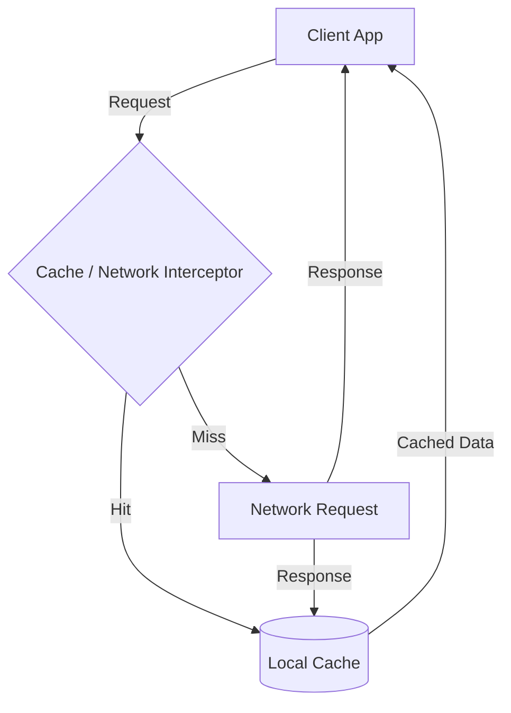

# Кэширование и офлайн-архитектура

Современный фронтенд давно перестал быть просто красивой оберткой для серверного API. Пользователи ожидают мгновенного отклика даже в метро или лифте, а миллисекундные задержки конвертируются в потерянную прибыль. Именно поэтому кэширование и офлайн-архитектура — это фундамент отказоустойчивых веб-приложений.

Какую боль мы решаем? Представьте, что каждое нажатие кнопки, каждый переход на новую страницу заставляет пользователя смотреть на лоадер, пока данные путешествуют через полмира. Кэширование позволяет нам "срезать углы", отдавая данные локально, а офлайн-архитектура делает приложение работоспособным даже при полном отсутствии сети.



## Как это работает
В основе лежит многоуровневая стратегия: от HTTP-заголовков (Cache-Control) до Service Workers, которые перехватывают сетевые запросы и работают как прокси на клиенте. 

Пример кэширования на уровне Service Worker:
```javascript
// Правильно: Кэшируем статику при установке
self.addEventListener('install', event => {
  event.waitUntil(
    caches.open('v1').then(cache => {
      return cache.addAll(['/index.html', '/app.css', '/main.js']);
    })
  );
});

// Антипаттерн: Кэширование всего подряд без стратегии очистки (Cache Quota Exceeded)
self.addEventListener('fetch', event => {
  event.respondWith(
    fetch(event.request).then(response => {
      const clone = response.clone();
      caches.open('all-data').then(cache => cache.put(event.request, clone));
      return response;
    })
  );
});
```

## Неочевидные нюансы
* **Оверхед на консистентность:** Самая сложная проблема в кэшировании — это инвалидация (удаление устаревших данных). Чем агрессивнее вы кэшируете, тем больше риск показать пользователю протухший стейт.
* **Storage Quota:** Локальное хранилище не бесконечно. iOS Safari может молча удалить ваш кэш (eviction), если на устройстве заканчивается место или пользователь давно не заходил на сайт.
* **Сложность тестирования:** Офлайн-состояния трудно покрыть E2E-тестами. Поведение Service Worker'ов зависит от жизненного цикла страницы и может отличаться в разных браузерах (особенно в старых версиях Safari).
