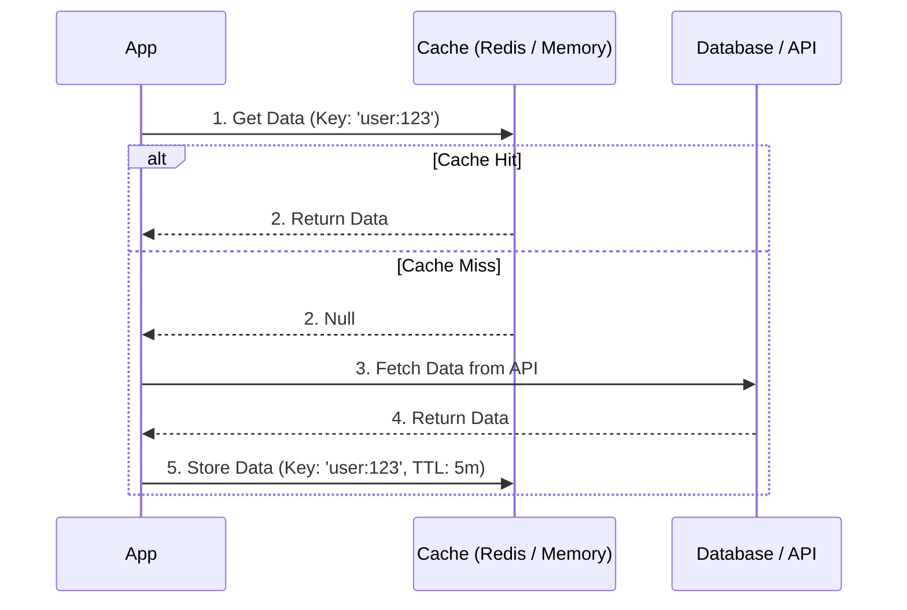

# Cache Aside (Кэширование в стороне)

**Cache Aside** (или Lazy Loading) — это одна из самых популярных стратегий кэширования на бэкенде, но она активно применяется и во фронтенде (например, в стейт-менеджерах). Суть: приложение само управляет кэшем, "откладывая" работу с ним на сторону.

Какую боль мы решаем? Представьте, что вы запрашиваете список статей. Если проксировать все запросы через кэш (как в Cache-Through), он может быстро забиться неактуальными данными. В Cache Aside приложение напрямую спрашивает кэш, и если там пусто — само идет в сеть и само кладет результат в кэш. Это дает полный контроль над тем, *что* именно кэшируется.



## Как это работает на практике

На фронтенде этот паттерн часто скрыт под капотом библиотек вроде `React Query` (в режиме `staleTime: Infinity`) или реализуется вручную в `Redux`.

```javascript
// Типичная реализация Cache Aside
async function getUserProfile(userId) {
  // 1. Проверяем кэш (Memory Cache / LocalStorage)
  const cachedUser = localStorage.getItem(`user_${userId}`);
  if (cachedUser) {
    return JSON.parse(cachedUser);
  }

  // 2. Идем в сеть (Miss)
  const response = await fetch(`/api/users/${userId}`);
  const user = await response.json();

  // 3. Кладем в кэш
  localStorage.setItem(`user_${userId}`, JSON.stringify(user));
  
  return user;
}
```

## Неочевидные нюансы
* **Проблема Cache Stampede (Эффект толпы):** Если кэш внезапно инвалидируется, сотни компонентов на странице могут одновременно получить Cache Miss и отправить 100 одинаковых запросов к API. Для решения нужен "Request Deduplication" — кэширование не только ответов, но и самих *промисов* (Promises) запросов.
* **Ручная инвалидация:** Поскольку кэш лежит "в стороне", база данных (или сервер) ничего о нем не знает. Когда данные обновляются (`PUT /api/users/123`), вы обязаны не забыть вручную удалить `user_123` из `localStorage`, иначе пользователь вечно будет видеть старую информацию (Stale Data).
