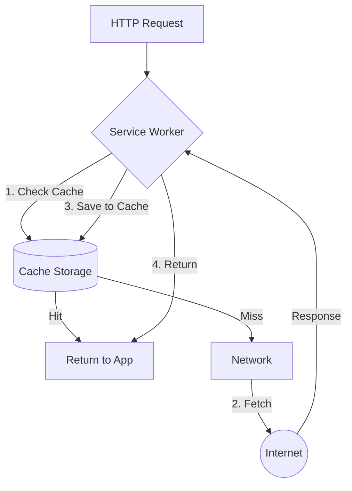

# Cache First (Cache falling back to network)

**Cache First** — это стратегия работы Service Worker'а, при которой приложение сначала ищет ответ в кэше и только в случае его отсутствия делает сетевой запрос.

Какую боль мы решаем? Ресурсы, которые никогда не меняются (например, шрифты, аватарки, JS-бандлы с хэшом в имени файла `app.a3f9c.js`), бессмысленно запрашивать из сети каждый раз. Cache First позволяет загружать такие файлы мгновенно, экономя трафик и батарею устройства, а сеть используется только как запасной вариант (fallback).



## Как это работает на практике

Это идеальная стратегия для статических ассетов (изображения, стили, скрипты).

```javascript
// Правильный паттерн Cache First в Service Worker
self.addEventListener('fetch', event => {
  event.respondWith(
    caches.match(event.request).then(cachedResponse => {
      // Hit: возвращаем из кэша мгновенно
      if (cachedResponse) {
        return cachedResponse;
      }
      
      // Miss: идем в сеть
      return fetch(event.request).then(networkResponse => {
        // Проверяем валидность ответа
        if (!networkResponse || networkResponse.status !== 200) {
          return networkResponse;
        }
        
        // Клонируем ответ и кэшируем
        const responseToCache = networkResponse.clone();
        caches.open('static-v1').then(cache => {
          cache.put(event.request, responseToCache);
        });
        
        return networkResponse;
      });
    })
  );
});
```

## Неочевидные нюансы
* **Опасность отравления кэша (Cache Poisoning):** Если вы примените Cache First к `index.html` (или к файлу без хэша в имени), пользователь закэширует его *навсегда*. Когда вы выпустите новую версию приложения, пользователь ее не увидит, так как Service Worker даже не спросит сервер об изменениях.
* **Ошибка в сети ломает всё:** Если запрос `fetch(event.request)` падает (ошибка CORS или обрыв сети), вы получите `TypeError`. Всегда добавляйте блок `catch` (Fallback), чтобы отдать дефолтную картинку-заглушку (например, "офлайн-динозавра"), если ни кэша, ни сети нет.
* **Переполнение квоты:** Эта стратегия жадно кэширует новые ресурсы. Если это галерея картинок, через неделю кэш займет 5 ГБ. Необходима реализация лимитирования (например, хранить только последние 50 картинок).
