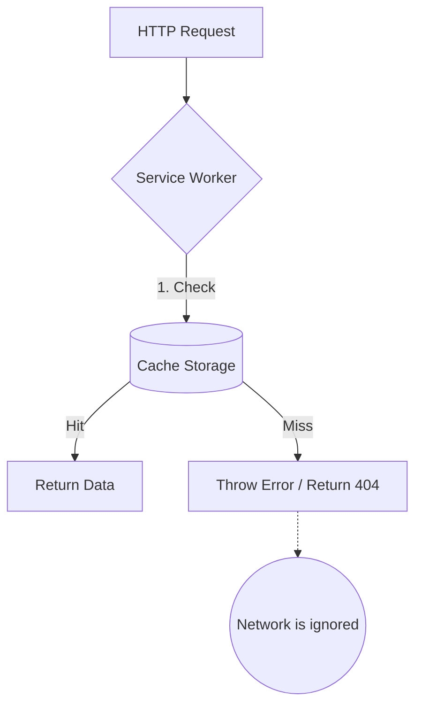

# Cache Only (Только кэш)

**Cache Only** — это самая жесткая стратегия кэширования, при которой запрос удовлетворяется **исключительно** из локального кэша. Если данных в кэше нет — запрос падает (сеть даже не опрашивается).

Какую боль мы решаем? Кажется странным сознательно отказываться от сети. Однако это незаменимый паттерн в архитектурах Offline First. Если вы скачали "Офлайн-карту" или "Плейлист в дорогу", приложение не должно пытаться подкачать недостающие куски из сети (чтобы не тратить дорогой роуминг). Оно должно работать строго в рамках того, что скачано.



## Как это работает на практике

Обычно этот паттерн используется для ресурсов, которые были предзагружены (precached) на этапе установки Service Worker'а (событие `install`).

```javascript
// Правильный паттерн Cache Only
self.addEventListener('fetch', event => {
  // Применяем стратегию только к специфичному маршруту (например, оффлайн картам)
  if (event.request.url.includes('/offline-tiles/')) {
    event.respondWith(
      caches.match(event.request).then(response => {
        if (response) {
          return response; // Отдаем из кэша
        }
        // Если нет в кэше — возвращаем заглушку или ошибку
        return new Response('Offline resource not found', {
          status: 404,
          statusText: 'Not Found'
        });
      })
    );
  }
});
```

## Неочевидные нюансы
* **Синхронизация состояний:** Главный риск стратегии — если ресурс не был успешно предзагружен в событии `install` (например, из-за моргания сети), стратегия Cache Only гарантированно сломает приложение. Поэтому фаза Precaching должна быть атомарной (либо скачалось всё, либо ничего).
* **Специфичные юзкейсы:** Стратегия редко применяется ко всему приложению. Чаще всего её комбинируют с роутингом (например, отдавать "App Shell" — каркас UI — всегда только из кэша).
* **Безопасность батареи:** Этот паттерн идеально подходит для фоновых задач на мобильных устройствах. Если Service Worker проснулся по таймеру чтобы обновить виджет, и вы используете Cache Only, радиомодуль смартфона даже не включится, экономя 20-30% заряда.
