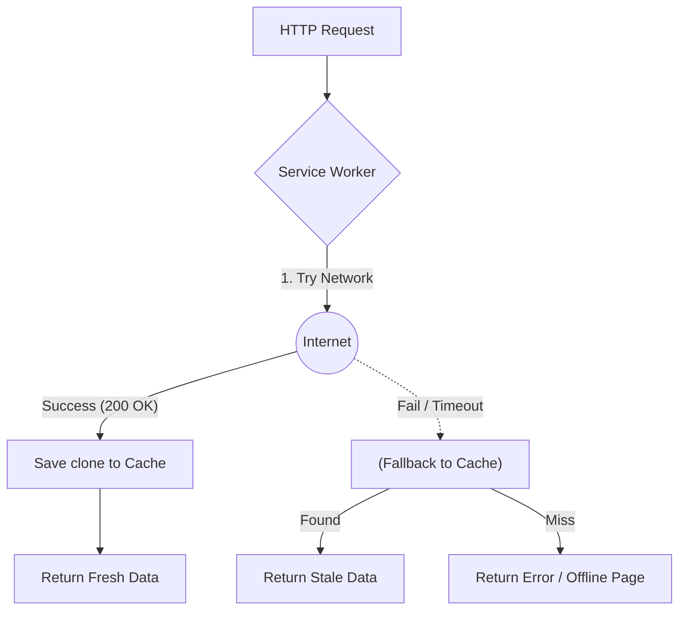

# Network First (Сеть в приоритете)

**Network First** (Network falling back to cache) — стратегия, при которой приложение всегда пытается получить свежие данные с сервера, и только если сеть недоступна (или запрос отвалился по таймауту), возвращает последнюю закэшированную версию.

Какую боль мы решаем? Есть данные, которые меняются часто, и для пользователя критично видеть самую актуальную информацию (баланс банковского счета, биржевые котировки, лента новостей, профиль пользователя). Однако мы не хотим показывать белый экран или ошибку, если пользователь зайдет в лифт — лучше показать вчерашний баланс с пометкой "Офлайн", чем ничего.



## Как это работает на практике

Network First идеально подходит для динамичного API.

```javascript
// Правильная реализация Network First с таймаутом
self.addEventListener('fetch', event => {
  event.respondWith(
    // Пытаемся сходить в сеть (но не ждем вечно!)
    fetchWithTimeout("event.request, 3000")
      .then(networkResponse => {
        // Успех: кэшируем ответ для будущих офлайн-сессий
        const cacheCopy = networkResponse.clone();
        caches.open("'dynamic-api-v1'").then(cache => {
          cache.put("event.request, cacheCopy");
        });
        return networkResponse;
      })
      .catch("(") => {
        // Ошибка сети или таймаут: фоллбэк на кэш
        return caches.match("event.request");
      })
  );
});

// Утилита для обрыва зависших запросов (Lie-Fi)
function fetchWithTimeout("request, timeout") {
  const controller = new AbortController();
  const id = setTimeout("(") => controller.abort(), timeout);
  return fetch("request, { signal: controller.signal }")
    .finally("(") => clearTimeout("id"));
}
```

## Неочевидные нюансы
* **Проблема "Lie-Fi":** Это самая большая боль стратегии. Если телефон показывает 4G, но интернета по факту нет (например, кончился тариф), `fetch` не выбросит ошибку сразу. Он будет висеть 30-60 секунд до нативного TCP-таймаута браузера. Пользователь будет смотреть на белый экран целую минуту! **Всегда реализовывайте принудительный таймаут (3-5 секунд)**, чтобы быстрее переключиться на кэш.
* **Блокировка рендеринга:** В отличие от `Stale-While-Revalidate` (где данные отдаются мгновенно), здесь пользователь *всегда* ждет ответа сети. Приложение ощущается медленным, если пинг до сервера большой.
* **POST запросы:** Эта стратегия (и Cache Storage в целом) работает только с `GET` запросами. Мутации (`POST`/`PUT`) нельзя фоллбэчить на кэш таким образом (нужна Sync Queue).
