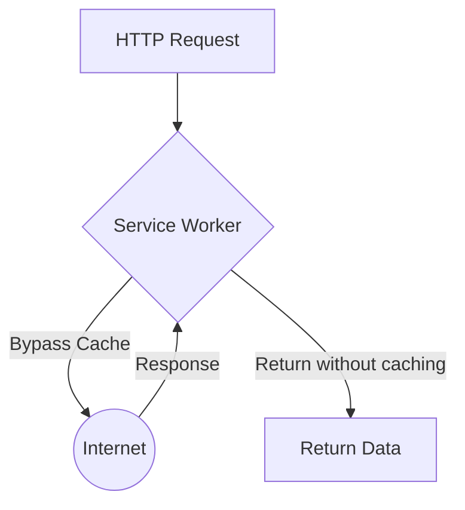

# Network Only (Только сеть)

**Network Only** — самая простая и дефолтная стратегия в вебе. Клиент всегда обращается к сети, минуя любой кэш (или Service Worker просто проксирует запрос).

Какую боль мы решаем? Есть данные, кэширование которых не просто бесполезно, а строго противопоказано. Это платежные транзакции, авторизация, корзина покупок, аналитика, а также любые мутации (POST/PUT/DELETE запросы). Для этих ресурсов критична абсолютная консистентность и безопасность.



## Как это работает на практике

Если у вас установлен Service Worker, все запросы по умолчанию проходят через него. Вы обязаны явно сказать ему пропустить определенные запросы.

```javascript
// Правильная реализация: исключение маршрутов
self.addEventListener('fetch', event => {
  const url = new URL(event.request.url);

  // Network Only для API корзины, авторизации и POST запросов
  if (url.pathname.startsWith('/api/auth') || 
      url.pathname.startsWith('/api/cart') || 
      event.request.method !== 'GET') {
    
    event.respondWith(fetch(event.request));
    return;
  }

  // Для остальных запросов применяем другие стратегии...
});
```

## Неочевидные нюансы
* **HTTP Кэш браузера:** Даже если ваш Service Worker реализует паттерн Network Only, запрос может быть перехвачен *встроенным HTTP-кэшем* браузера, если сервер прислал заголовок `Cache-Control: max-age=3600`. Чтобы гарантировать настоящий Network Only, нужно убедиться, что сервер шлет `Cache-Control: no-store`.
* **Офлайн:** В случае отсутствия сети запрос неизбежно упадет с ошибкой (например, `TypeError: Failed to fetch`). Это ожидаемое поведение. Однако с точки зрения UX, вы должны перехватить эту ошибку на уровне UI и показать понятное сообщение ("Для оплаты требуется интернет-соединение"), а не просто сломать страницу.
