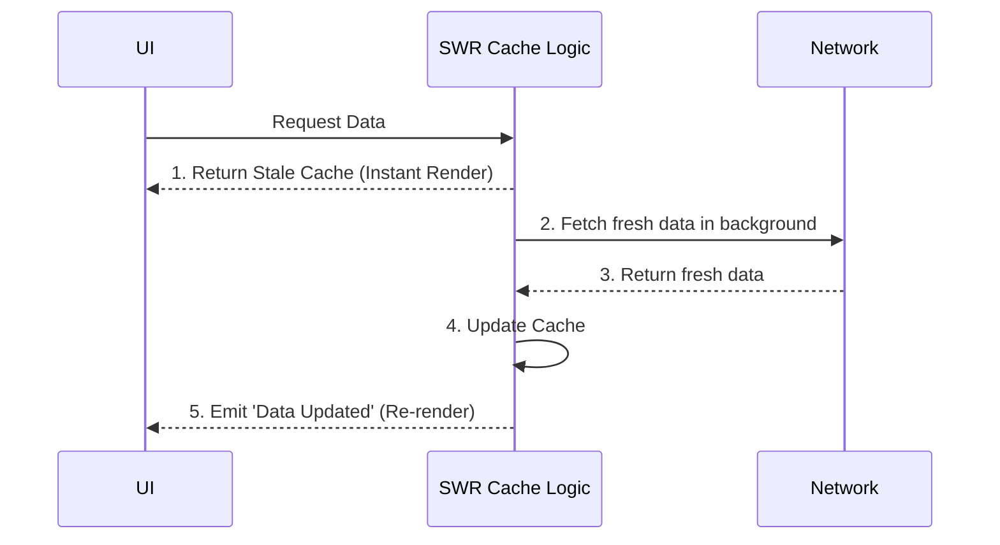

# Stale While Revalidate (SWR)

**Stale While Revalidate** — это "золотая пуля" кэширования для фронтенда. Суть: мгновенно отдать пользователю старые (stale) данные из кэша для быстрого рендера UI, а в фоне (незаметно для пользователя) сделать запрос в сеть и обновить кэш.

Какую боль мы решаем? Network First показывает спиннер, пока не ответит сеть. Cache First показывает старые данные и не обновляет их. SWR совмещает лучшее: мгновенную загрузку (UX без лоадеров) и поддержание актуальности данных (в фоне).



## Как это работает на практике

Этот паттерн стал стандартом де-факто в современных React-приложениях благодаря библиотекам `SWR` (от Vercel) и `React Query`.

```javascript
// Пример: Внутренняя реализация паттерна SWR на Service Worker'е
self.addEventListener('fetch', event => {
  event.respondWith(
    caches.match(event.request).then(cachedResponse => {
      // Идем в сеть в любом случае
      const fetchPromise = fetch(event.request).then(networkResponse => {
        caches.open('swr-v1').then(cache => {
          cache.put(event.request, networkResponse.clone());
        });
        return networkResponse;
      });

      // Возвращаем кэш если есть, иначе ждем ответа сети
      return cachedResponse || fetchPromise;
    })
  );
});

// Использование в React (с библиотекой useSWR)
import useSWR from 'swr';
function Profile() {
  // Мгновенно вернет старые данные, затем перерендерится с новыми
  const { data, error } = useSWR('/api/user', fetcher);
  if (!data) return <div>Loading...</div>;
  return <div>Привет, {data.name}!</div>;
}
```

## Неочевидные нюансы
* **Мерцание UI (Layout Shift):** Если старые данные сильно отличаются от новых (например, список из 1 элемента превратился в список из 50), страница дернется прямо во время чтения. Это раздражает пользователя. Используйте анимации для сглаживания или замораживайте скролл.
* **Лишние запросы (Overfetching):** SWR по умолчанию очень агрессивен. Библиотеки могут делать ревалидацию при фокусе окна, при смене вкладки, при восстановлении сети. Это может создать огромную нагрузку (DDoS) на ваш бэкенд, если не настроить параметр `dedupingInterval` (интервал дедупликации).
* **Сложность дебага:** Вы видите на экране одни данные, а в Network вкладке — другие. Это нормально для SWR, но сводит с ума начинающих разработчиков.
