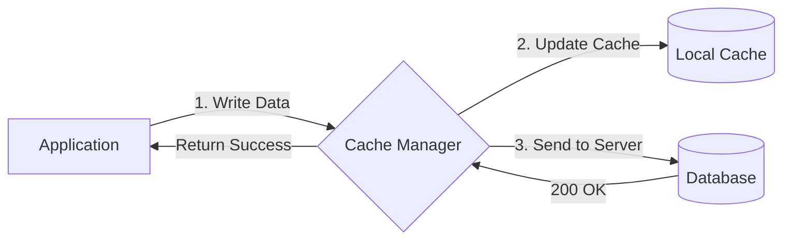

# Write Through Cache (Сквозная запись)

**Write Through Cache** — это стратегия кэширования, при которой любые мутации (запись, обновление) данных происходят *одновременно* и в локальный кэш, и в основную базу данных (на сервер).

Какую боль мы решаем? В стратегии Cache Aside, если пользователь обновил свой профиль (совершил PUT-запрос), мы должны не забыть вручную почистить кэш (инвалидация), иначе следующий GET-запрос вернет старое имя. Write Through инкапсулирует эту логику: процесс записи гарантирует, что кэш и БД всегда консистентны.



## Как это работает на практике

На фронтенде этот паттерн часто совмещается с концепцией **Optimistic UI**. Вы обновляете кэш (чтобы UI мгновенно отреагировал), и параллельно шлете запрос на сервер. В классическом бэкенд-понимании, операция считается успешной только когда *оба* хранилища подтвердили запись.

```javascript
// Правильный паттерн сквозной записи в стейт-менеджере
class StoreManager {
  async saveUserProfile(user) {
    // 1. Сохраняем в локальный кэш (мгновенно)
    localDB.users.put(user);
    
    try {
      // 2. Сквозная запись на сервер
      const response = await fetch('/api/users', {
        method: 'PUT',
        body: JSON.stringify(user)
      });
      
      if (!response.ok) throw new Error('Server rejected');
      
      return true;
    } catch (err) {
      // 3. Rollback (откат) при ошибке
      localDB.users.put(getPreviousVersion(user.id));
      throw err;
    }
  }
}
```

## Неочевидные нюансы
* **Высокий Latency (задержка):** Если ваша сквозная запись *синхронная* (то есть вы ждете ответа от сервера перед тем, как разблокировать UI), то приложение будет тормозить ровно настолько, насколько тормозит сервер.
* **Race Conditions (Состояние гонки):** Если пользователь дважды быстро нажал "Сохранить", запрос А и запрос Б уйдут на сервер. Локальный кэш может принять состояние запроса Б (как более нового), но если сервер обработает запрос Б быстрее, чем А (из-за задержек сети), то финальное состояние в БД будет от запроса А. Кэш и БД рассинхронизируются. Для решения нужны Версионирование (Version Vectors) или очереди (Sync Queue).
* **Сложность Rollback:** Если запись на сервер упала (500 ошибка), вы должны откатить локальный кэш к предыдущему состоянию. Для этого вам нужно всегда хранить "снепшот" предыдущего стейта до начала мутации.
