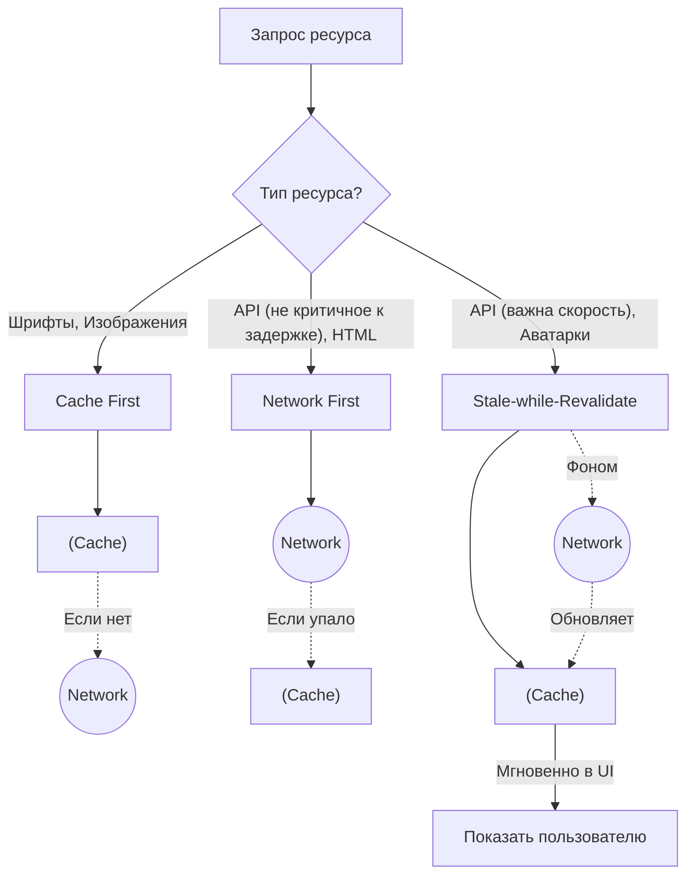

# Стратегии кэширования в Service Worker

Когда мы перехватываем сетевой запрос в Service Worker, у нас есть выбор: сходить в кэш или в сеть? Ответ зависит от того, насколько важна свежесть данных против скорости загрузки.

## Какую боль мы решаем?
Разные типы ресурсов требуют разного отношения. Шрифты и логотипы не меняются годами — их нужно отдавать из кэша мгновенно. А вот баланс банковского счета всегда должен быть свежим. Применяя единый подход ко всему, мы либо получаем медленный сайт, либо показываем неактуальные данные.

## Основные стратегии



### 1. Cache First (Сначала кэш, потом сеть)
Идеально для статики. Если файл есть в кэше — отдаем сразу. В сеть идем только если файла нет.
* **Применимость:** Изображения, шрифты, CSS/JS бандлы с хэшами в именах файлов (`app.a3f1b.js`).

### 2. Network First (Сначала сеть, резерв в кэше)
Пытаемся получить свежие данные с сервера. Если офлайн или таймаут — показываем последнее закешированное.
* **Применимость:** Лента новостей, дашборды.
* **Трейдофф:** При плохой сети пользователь будет долго ждать ответа сети (лоадер), прежде чем стратегия сдастся и покажет кэш.

### 3. Stale-while-Revalidate (SWR) — Золотой стандарт
Мгновенно отдает данные из кэша, но в фоне незаметно делает запрос к серверу, чтобы обновить кэш для следующего раза.
* **Применимость:** Большинство GET-запросов API, профиль пользователя.

## Примеры кода

### Пример реализации Stale-while-Revalidate
```javascript
// В Service Worker
self.addEventListener('fetch', (event) => {
  if (event.request.url.includes('/api/')) {
    event.respondWith(
      caches.open('api-cache').then((cache) => {
        return cache.match(event.request).then((cachedResponse) => {
          
          // Фоновый запрос за свежими данными
          const fetchPromise = fetch(event.request).then((networkResponse) => {
            cache.put(event.request, networkResponse.clone());
            return networkResponse;
          });
          
          // Возвращаем кэш сразу, либо ждем сеть, если кэша еще нет
          return cachedResponse || fetchPromise;
        });
      })
    );
  }
});
```
*(Примечание: на практике лучше использовать библиотеку Workbox от Google, чем писать это руками).*

## Неочевидные нюансы
* **Кэширование ошибок:** Если в `Network First` сервер вернет 500 ошибку, вы можете случайно закешировать этот ответ и перезаписать хорошие данные в кэше. Всегда проверяйте `response.ok` перед `cache.put()`.
* **Лимит памяти:** Стратегия `Cache First` без механизма очистки быстро переполнит память устройства пользователя.
* **Рассинхронизация UI в SWR:** В SWR данные обновляются в фоне. Если UI не подписан на изменения кэша, пользователь увидит старые данные, пока не обновит страницу, хотя кэш уже свежий.
