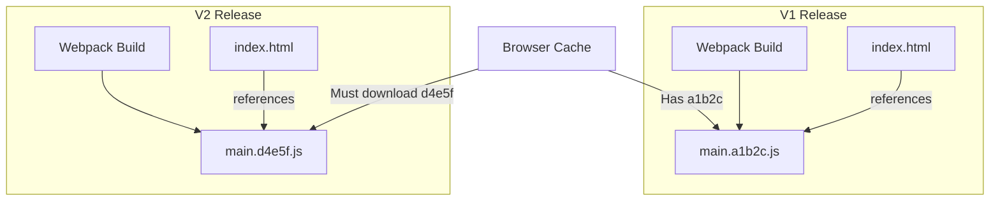

# Cache Busting (Обход кэша)

**Cache Busting** — это техника принудительного сброса браузерного кэша для конкретного файла путем изменения его URL. 

Какую боль мы решаем? Представьте: вы выкатили новый дизайн (`style.css`), но пользователи жалуются, что сайт сломан. Причина: их браузер закэшировал старый `style.css` на год вперед и даже не пытается скачать новый. Cache Busting решает эту проблему элегантно: мы делаем так, чтобы браузер думал, что запрашивает *совершенно новый* файл.



## Как это работает на практике

Есть два основных подхода: Query-параметры и Content Hash (Хэширование по содержимому). В современном фронтенде используется только Content Hash.

```html
<!-- Антипаттерн: Query String -->
<!-- Некоторые прокси-серверы (CDN) игнорируют query-параметры при кэшировании -->
<script src="/js/app.js?v=2.1.0"></script>

<!-- Правильный паттерн: Content Hash в имени файла -->
<script src="/js/app.8f3a9e2d.js"></script>
```

В Webpack или Vite это настраивается из коробки при production сборке (`[name].[contenthash].js`).

## Неочевидные нюансы
* **index.html кэшировать нельзя:** Самая частая ошибка — применить жесткий кэш к самому `index.html`. Если закэшировать его, браузер никогда не узнает, что нужно скачивать новый `app.8f3a9e2d.js`. Сервер всегда должен отдавать `index.html` с заголовком `Cache-Control: no-cache`.
* **Засорение сервера (и CDN):** При каждой сборке генерируются новые файлы. Старые (вида `app.a1b2c.js`) остаются на сервере, постепенно съедая диск. Их нужно удалять, но *осторожно*: если пользователь открыл вкладку вчера, а сегодня вы удалили старый чанк, при попытке перейти на другую страницу роутер (React Router) упадет с `ChunkLoadError`.
