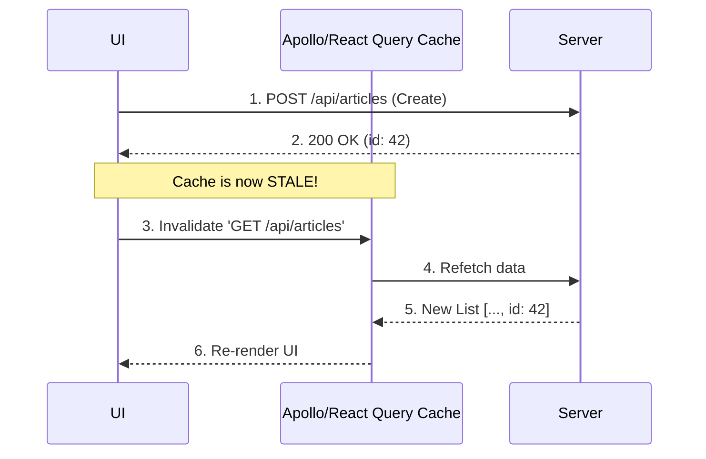

# Cache Invalidation (Инвалидация кэша)

*"В программировании есть только две сложные вещи: инвалидация кэша и придумывание имен."* — Фил Карлтон.

**Инвалидация кэша** — это процесс объявления сохраненных данных устаревшими (stale) и их принудительное удаление или обновление.

Какую боль мы решаем? Кэш позволяет отдавать данные мгновенно, но если данные изменились в базе, кэш превращается в источник лжи. Если мы не очистим кэш после того, как пользователь поменял аватарку, он будет видеть старую и подумает, что приложение сломалось.



## Как это работает на практике

Существует три основных подхода к инвалидации:
1. **По времени (TTL):** Кэш протухает сам через X секунд. (Самый простой, но допускает неконсистентность).
2. **Императивно (Ручная очистка):** Разработчик явно пишет `cache.remove('key')` после мутации.
3. **Декларативно (Через теги):** Кэшу присваиваются теги, и мы инвалидируем сразу всё по тегу.

```javascript
// Правильный паттерн (React Query): Инвалидация по ключу
const queryClient = useQueryClient();

const mutation = useMutation({
  mutationFn: updateProfile,
  onSuccess: () => {
    // Говорим кэшу: все запросы, начинающиеся с 'profile', устарели.
    // Если компонент с этим ключом сейчас на экране - произойдет фоновый рефетч.
    queryClient.invalidateQueries({ queryKey: ['profile'] });
  },
});
```

## Неочевидные нюансы
* **Избыточная инвалидация (Over-fetching):** Если у вас сложный ключ `['users', 'list', { page: 1 }]`, а вы инвалидируете весь корень `['users']`, вы можете заставить приложение перекачать десятки мегабайт данных, хотя изменился один профиль. Инвалидация должна быть точечной.
* **Каскадная инвалидация:** Если пользователь удалил "Организацию", нужно инвалидировать не только саму организацию, но и списки проектов этой организации, списки сотрудников этой организации. Вручную это сделать почти невозможно без багов — здесь на помощь приходят **Cache Tags** (Теги кэширования).
* **Distributed Systems:** Если у вас кэш на сервере (Redis), кэш в CDN (Cloudflare) и кэш в браузере (Service Worker) — инвалидировать их все одновременно практически невозможно. Приходится мириться с Eventual Consistency (итоговой согласованностью).
