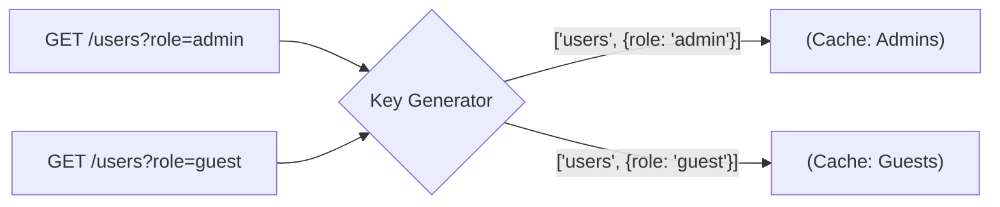

# Cache Keys (Ключи кэширования)

**Ключ кэша** — это уникальный идентификатор (строка, массив или хэш), по которому приложение или сервер определяет, лежат ли запрашиваемые данные уже в "коробке", или их нужно добывать. 

Какую боль мы решаем? Представьте, что вы кэшируете ответ от `/api/users`. Если вы используете URL как ключ, то запросы `/api/users?sort=asc` и `/api/users?sort=desc` запишутся в одну ячейку, перетерев друг друга! Правильное проектирование ключей — залог того, что разные компоненты не будут получать чужие данные.



## Как это работает на практике

Исторически ключом был просто строковый URL. Современные инструменты фронтенда (React Query, SWR, Apollo) используют массивы (Tuple) или сложные объекты для иерархического построения ключей.

```javascript
// Антипаттерн: Строковый ключ (трудно инвалидировать части)
const key = `/api/users?role=${role}&page=${page}`; 
cache.get("key"); // При инвалидации придется использовать RegEx!

// Правильный паттерн (React Query): Иерархический массив ключей
// Читается от общего к частному
const queryKey = ['users', 'list', { role: 'admin', page: 2 }];

// Это позволяет инвалидировать кэш гибко:
// Сбросить всё, связанное с юзерами:
queryClient.invalidateQueries("['users']"); 

// Сбросить только списки, но не конкретных юзеров (['users', 'detail', 123]):
queryClient.invalidateQueries("['users', 'list']");
```

## Неочевидные нюансы
* **Порядок ключей в объекте имеет значение:** Если вы генерируете строковый хэш из объекта на лету (например, `JSON.stringify("params")`), то `{a: 1, b: 2}` и `{b: 2, a: 1}` дадут *разные* строки, а значит — *разные Cache Miss*. Инструменты вроде React Query делают детерминированную сериализацию "под капотом", но если вы пишете свой кэш — помните об этом.
* **Глобальный стейт (Авторизация):** Часто забывают включать в ключ кэша `tenantId` (в B2B SaaS) или `userId`. В итоге, если пользователь сделает Logout и зайдет под другим аккаунтом без перезагрузки страницы (SPA), он может увидеть закэшированные приватные данные предыдущего пользователя.
