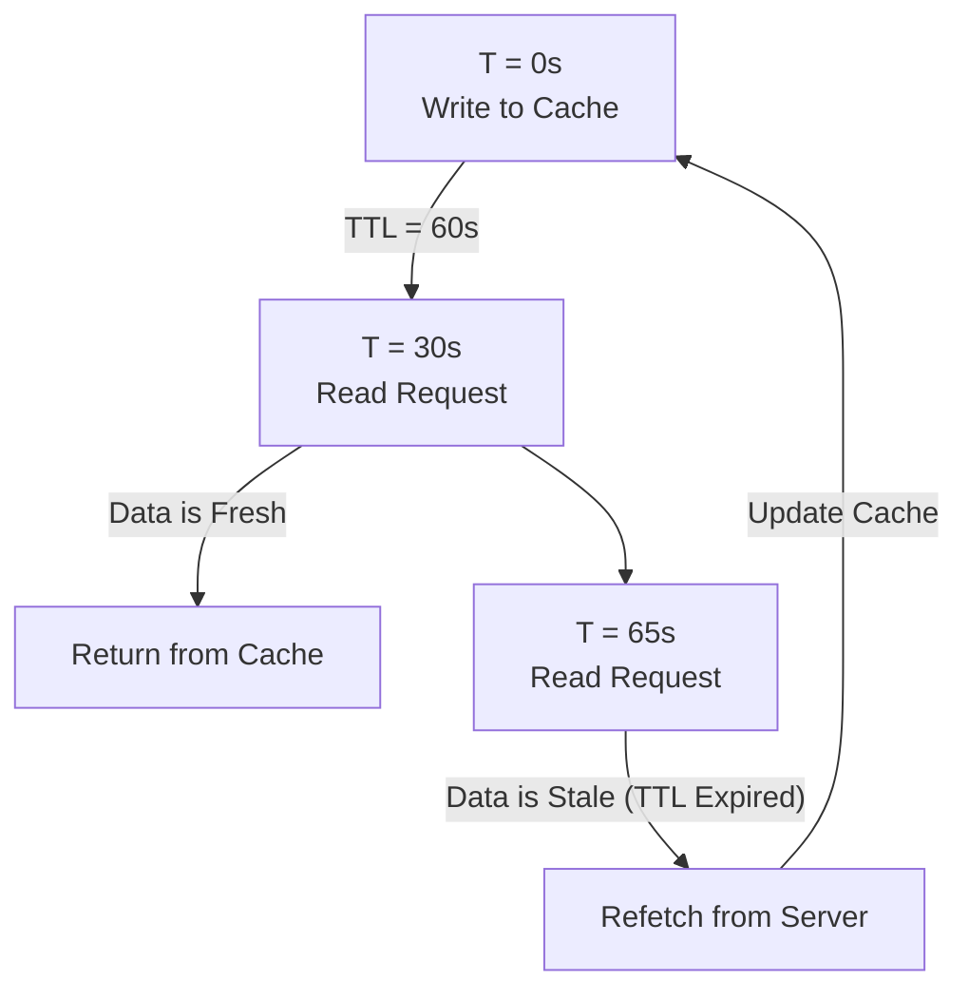

# Cache TTL (Time-To-Live)

**TTL (Time-To-Live)** — это "срок годности" закэшированных данных. Это интервал времени, в течение которого данные считаются свежими (fresh) и могут отдаваться без проверки на сервере. По истечении TTL данные объявляются "протухшими" (stale).

Какую боль мы решаем? Если мы закэшируем данные навсегда, мы никогда не увидим обновлений. Если не кэшировать вообще — будет медленно. TTL — это компромисс. Мы говорим: "Меня устроит, если курс валют в UI будет отставать от реального максимум на 5 минут".



## Как это работает на практике

На уровне протокола HTTP TTL задается заголовком `Cache-Control: max-age=60` (в секундах). На уровне фронтенд-библиотек это настраивается опциями вроде `staleTime` или `cacheTime`.

```javascript
// Правильный паттерн (React Query): Настройка TTL под тип данных

// 1. Курсы валют (TTL: 1 минута)
useQuery({
  queryKey: ['rates'],
  queryFn: fetchRates,
  staleTime: 60 * 1000 // Данные свежие ровно 1 минуту
});

// 2. Статический справочник стран (TTL: бесконечность)
useQuery({
  queryKey: ['countries'],
  queryFn: fetchCountries,
  staleTime: Infinity // Данные никогда не протухнут за сессию
});
```

## Неочевидные нюансы
* **Разница между `staleTime` и `cacheTime`:** Это частая путаница в React Query. 
  - `staleTime` (TTL) — сколько времени данные можно показывать *без фонового рефетча* (по умолчанию 0).
  - `cacheTime` (Garbage Collection Time) — сколько времени хранить данные в памяти *после того, как компонент размонтировался* (по умолчанию 5 минут).
* **Синхронизация часов (Clock Skew):** При использовании HTTP-заголовка `Expires` (старый аналог `Cache-Control`) возникает проблема, если часы на сервере и у клиента расходятся. Всегда используйте относительный `max-age`.
* **Thundering Herd (Эффект стада):** Если вы выставили TTL в 5 минут для виджета на главной странице, и ровно через 5 минут на сайте сидит 10 000 человек, их браузеры одновременно поймут, что кэш протух, и отправят 10 000 запросов на бэкенд, положив сервер. Для решения используют Jitter (добавление случайной погрешности в TTL).
