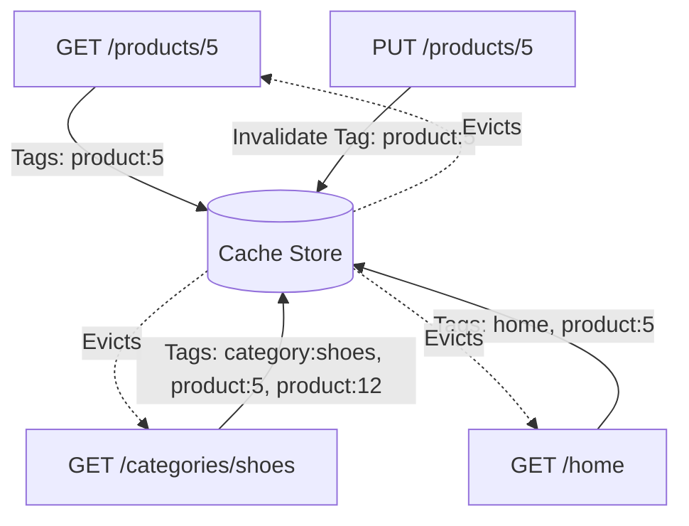

# Cache Tags (Тегирование кэша)

**Cache Tags** — это механизм ассоциации одной или нескольких строковых меток (тегов) с конкретной записью в кэше. Это позволяет инвалидировать кэш не по точному ключу, а по логической группе.

Какую боль мы решаем? Представьте, что у вас есть API для интернет-магазина. Если вы обновили цену товара ID=5, вам нужно сбросить: кэш самого товара, кэш списка товаров в категории, кэш главной страницы (где этот товар в топе) и кэш корзины. Искать все эти ключи и очищать их вручную — это путь к багам. Теги позволяют сказать: "Сбрось всё, что имеет тег `product:5`".



## Как это работает на практике

Тегирование активно используется в серверном кэшировании (Redis, Varnish) и в современных фронтенд-фреймворках (например, Next.js App Router).

```javascript
// Пример: Использование Cache Tags в Next.js (App Router)

// 1. При fetch-запросе указываем теги:
async function getProduct(id) {
  const res = await fetch(`https://api.example.com/products/${id}`, {
    next: { tags: [`product:${id}`] } // Привязываем тег
  });
  return res.json();
}

// 2. В Server Action при обновлении товара:
import { revalidateTag } from 'next/cache';

export async function updateProductPrice(id, newPrice) {
  await db.product.update({ where: { id }, data: { price: newPrice } });
  
  // Мгновенно сбрасывает все страницы/компоненты, которые использовали этот тег!
  revalidateTag(`product:${id}`); 
}
```

## Неочевидные нюансы
* **Разбухание заголовков:** В HTTP-кэшировании (CDN типа Cloudflare) теги передаются через заголовок `Cache-Tag` или `Surrogate-Key`. Если запрос собирает страницу из 1000 товаров, заголовок с тегами может превысить лимит веб-сервера (обычно 8KB), и сервер отдаст 431 Request Header Fields Too Large.
* **Трудоемкость отслеживания:** На стороне бэкенда при сборке сложного JSON ответа необходимо аккуратно собрать все теги от всех сущностей, участвующих в запросе. Если вы забудете добавить тег автора к статье, при изменении имени автора статья не обновится.
