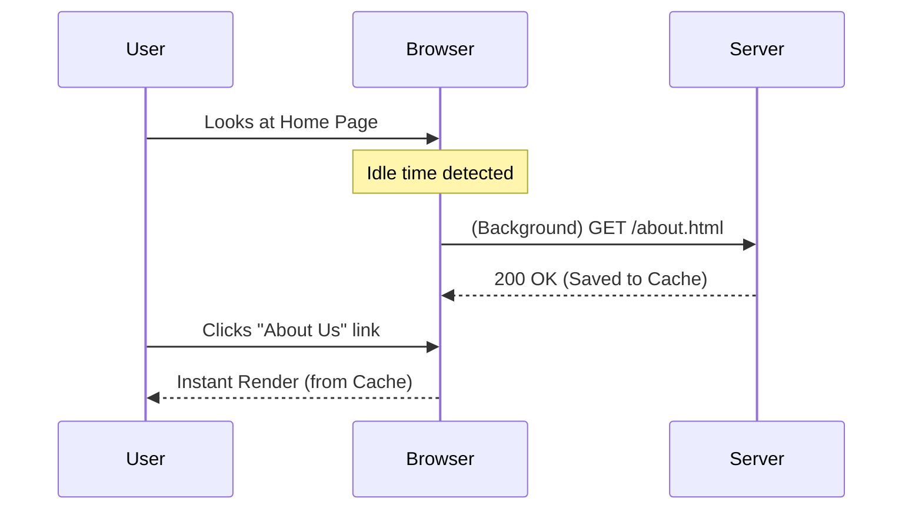

# Prefetching (Предварительная выборка)

**Prefetching** — это техника загрузки ресурсов или данных *до* того, как они понадобятся пользователю (в фоне, пока браузер простаивает).

Какую боль мы решаем? Даже с идеальным кэшированием, первый переход на новую страницу займет время (нужно сходить в сеть). Prefetching позволяет "предугадать" действия пользователя и загрузить следующую страницу заранее. Когда пользователь кликнет на ссылку, страница откроется мгновенно (из кэша).



## Как это работает на практике

На фронтенде это реализуется через HTML тег `<link rel="prefetch">` или программно через JavaScript (Service Worker / Fetch API).

```html
<!-- Правильный паттерн: HTML Prefetching (Браузер скачает это с низким приоритетом) -->
<link rel="prefetch" href="/css/checkout.css">
<link rel="prefetch" href="/js/checkout-bundle.js">
```

```javascript
// Правильный паттерн: Prefetching данных при наведении (Hover Intent)
import { useQueryClient } from 'react-query';

function ArticleLink({ id, title }) {
  const queryClient = useQueryClient();

  const prefetchData = () => {
    // Как только пользователь навел мышку на ссылку, начинаем качать данные.
    // Обычно между hover и click проходит 200-300ms — этого хватит для ответа сервера!
    queryClient.prefetchQuery(['article', id], () => fetchArticle(id));
  };

  return <a href={`/article/${id}`} onMouseEnter={prefetchData}>{title}</a>;
}
```

## Неочевидные нюансы
* **Трата трафика:** Если вы делаете prefetch для *всех* ссылок на странице (как это делал ранний Next.js), вы потратите мегабайты трафика пользователя впустую. Это критично на мобильных устройствах. Учитывайте `navigator.connection.saveData` (режим экономии трафика) перед вызовом prefetch.
* **Приоритеты:** `<link rel="prefetch">` скачивает ресурсы с самым низким приоритетом (`Lowest`). Это гарантирует, что предзагрузка не помешает загрузке текущей страницы.
* **Prefetch vs Preload:** Prefetch — это для *будущих* навигаций (возможно понадобится). Preload — это для *текущей* страницы (точно понадобится прямо сейчас, грузи срочно). Не путайте их.
