# Preloading (Предзагрузка)

**Preloading** — это декларативный способ сказать браузеру: "Этот ресурс критически важен для *текущей* страницы. Начни качать его как можно быстрее, с высоким приоритетом, даже до того, как парсер дойдет до него в HTML или CSS".

Какую боль мы решаем? Браузер качает ресурсы по мере их обнаружения. Если ваш главный шрифт подключен в `app.css`, браузер сначала скачает HTML, затем скачает `app.css`, распарсит его, найдет `@font-face` и только *потом* начнет качать шрифт. Пользователь увидит FOIT (Flash of Invisible Text) или прыжок шрифтов. Preload ломает эту цепочку и запускает загрузку шрифта параллельно с HTML.

```mermaid
gantt
    title Without Preload
    dateFormat  s
    axisFormat  %S
    HTML Parsing : a1, 0, 2s
    CSS Download & Parse : a2, after a1, 2s
    Font Download (Discovered late) : a3, after a2, 3s
    
    title With Preload
    HTML Parsing : b1, 0, 2s
    CSS Download : b2, 0, 2s
    Font Download (Preloaded) : b3, 0, 3s
```



## Как это работает на практике

Используется тег `<link rel="preload">` в `<head>` документа.

```html
<!-- Правильный паттерн: Предзагрузка критического шрифта -->
<!-- ОБЯЗАТЕЛЬНО crossorigin, иначе браузер скачает шрифт дважды (баг спецификации) -->
<link rel="preload" href="/fonts/Inter-Bold.woff2" as="font" type="font/woff2" crossorigin>

<!-- Предзагрузка LCP (Largest Contentful Paint) картинки -->
<link rel="preload" href="/hero-banner.jpg" as="image">
```

В HTTP/2 это можно делать даже на уровне сервера (HTTP/2 Server Push), но эта технология была признана сложной и сейчас заменяется заголовками `Link: <...>; rel=preload`.

## Неочевидные нюансы
* **Предупреждения в консоли:** Если вы сделали `preload` ресурса, но он не понадобился странице в течение 3 секунд, браузер выведет желтый warning: *«The resource was preloaded using link preload but not used...»*. Это пустая трата ресурсов и приоритета сети.
* **Борьба за полосу пропускания:** Если сделать preload вообще всего, вы нивелируете сам смысл приоритезации. HTML парсер застрянет, пока скачиваются ваши 10 картинок. Preload нужно использовать *только* для 1-2 критических ресурсов (Hero Image, 1 главный шрифт).
* **Атрибут `as`:** Указывать атрибут `as="font"` (или `script`, `style`) — строго обязательно. Браузер использует его для установки правильного приоритета в очереди загрузки и применения нужной политики CORS.
