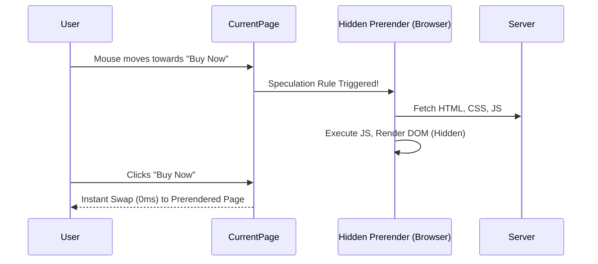

# Speculative Fetching (Спекулятивная выборка)

**Speculative Fetching** (или Speculative Prerendering) — это агрессивная эволюция Prefetching'а. Браузер не просто скачивает ресурсы следующей страницы, он **полностью рендерит её в скрытой фоновой вкладке** (включая выполнение JS), основываясь на вероятности того, что пользователь туда перейдет.

Какую боль мы решаем? Prefetch скачивает только HTML/JS, но когда пользователь кликает, браузеру все равно нужно время на парсинг, выполнение React/Vue и отрисовку DOM. Speculative Fetching делает переход абсолютно мгновенным (0 мс), как переключение вкладок.



## Как это работает на практике

Современный способ (поддерживается в Chromium-браузерах) — использование API **Speculation Rules API** (через JSON-конфиг в `<script>`).

```html
<!-- Правильный паттерн: Speculation Rules -->
<script type="speculationrules">
{
  "prerender": [
    {
      "source": "list",
      "urls": ["/cart", "/checkout"],
      // Срабатывает только когда пользователь навел курсор (hover) 
      // или начал нажимать кнопку (mousedown)
      "eagerness": "moderate" 
    }
  ]
}
</script>
```
Библиотеки вроде `quicklink` или фичи Next.js (через `<Link>`) могут инжектить эти правила динамически.

## Неочевидные нюансы
* **Тяжелые побочные эффекты (Side Effects):** Поскольку страница реально выполняется в фоне, **аналитика сработает до того, как пользователь открыл страницу**. Вы получите кучу фейковых просмотров. Чтобы этого избежать, нужно использовать `document.prerendering` API:
  ```javascript
  if (document.prerendering) {
    document.addEventListener('prerenderingchange', sendAnalytics);
  } else {
    sendAnalytics();
  }
  ```
* **Потребление RAM:** Рендеринг целой вкладки в фоне требует много оперативной памяти и ресурсов CPU. Браузеры жестко лимитируют количество активных спекулятивных пререндеров (обычно не более одного за раз).
* **Ограничения:** Prerender не сработает для страниц, требующих авторизации (если куки еще не установлены) или если сервер ответил отличным от 2xx статусом. Также отключается при экономии заряда батареи.
