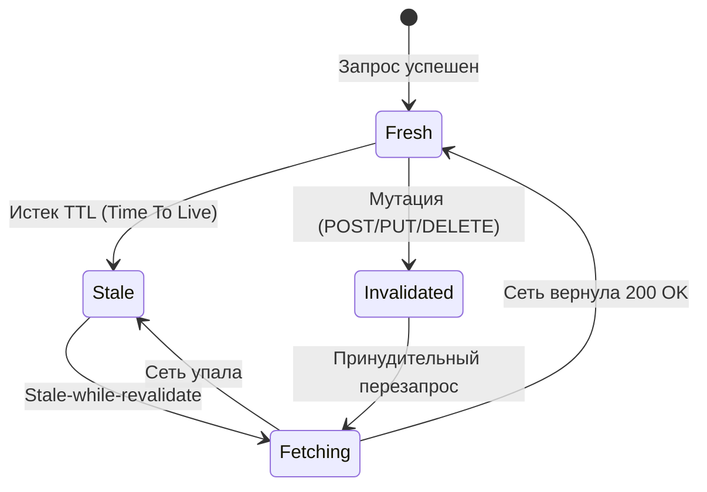

# Управление кэшем и инвалидация

"В computer science есть только две сложные проблемы: инвалидация кэша и придумывание названий". Как только мы начинаем кэшировать данные на клиенте, возникает риск показать пользователю устаревшую (stale) информацию. 

## Какую боль мы решаем?
Мы боремся с ситуацией "зомби-состояния", когда бэкенд уже обновился, а фронтенд упорно показывает старые данные, потому что они застряли в LocalStorage, Service Worker или памяти (RAM). Управление кэшем — это набор правил, как и когда данные должны "протухнуть" (TTL) и удалиться.

## Как это работает (Ключевые концепции)



### 1. Версионирование (Cache Busting)
Лучший способ инвалидации статики — изменение имени файла. Если `main.css` станет `main.v2.css`, браузер гарантированно скачает новый файл. 
### 2. Time-To-Live (TTL)
Каждой записи дается срок годности (например, 5 минут). Если время вышло, данные считаются "протухшими".
### 3. Ручная инвалидация по ключам (Tag-based)
Когда происходит мутация (добавление комментария), мы принудительно удаляем кэш по ключу `['comments', postId]`.

## Примеры кода

### Антипаттерн: Хранение в LocalStorage без срока годности
```javascript
// Пользователь зашел в админку, мы сохранили список ролей
localStorage.setItem('roles', JSON.stringify(roles));
// Если админ добавит новую роль на сервере, 
// текущий пользователь никогда ее не увидит, пока не почистит кэш браузера вручную.
```

### Как надо: Инвалидация через React Query
Библиотеки вроде TanStack (React) Query берут сложную работу по инвалидации на себя.

```typescript
import { useQuery, useMutation, useQueryClient } from '@tanstack/react-query';

// Читаем список задач
const { data: todos } = useQuery({ 
  queryKey: ['todos'], 
  queryFn: fetchTodos,
  staleTime: 1000 * 60 * 5 // Данные свежие 5 минут
});

const queryClient = useQueryClient();

// Мутация: добавление задачи
const mutation = useMutation({
  mutationFn: postTodo,
  onSuccess: () => {
    // Инвалидируем кэш! 
    // React Query мгновенно пойдет в сеть за свежим списком и обновит UI
    queryClient.invalidateQueries({ queryKey: ['todos'] });
  },
});
```

## Неочевидные нюансы и трейдоффы

* **LocalStorage vs IndexedDB vs Cache API:**
  * `LocalStorage` — синхронный, блокирует главный поток (UI начинает тормозить при больших объемах). Лимит ~5MB. **Только для мелких настроек**.
  * `IndexedDB` — асинхронная NoSQL база. Отлично подходит для хранения бизнес-объектов (JSON) и больших массивов данных.
  * `Cache API` (в Service Worker) — идеально для кэширования самих `Response` объектов (картинки, HTML, CSS, сырые ответы API).
* **Гонка мутаций:** Если пользователь быстро нажмет кнопку "Лайк" 5 раз, отправятся 5 мутаций. Если инвалидация настроена неверно, последний пришедший ответ от медленного первого запроса может перезаписать кэш старым значением.
* **Оверхед на память:** Инвалидация удаляет старое, но если пользователь посетил 1000 страниц, кэш разрастется. Необходим механизм Garbage Collection (например, хранение не более 50 последних элементов).
